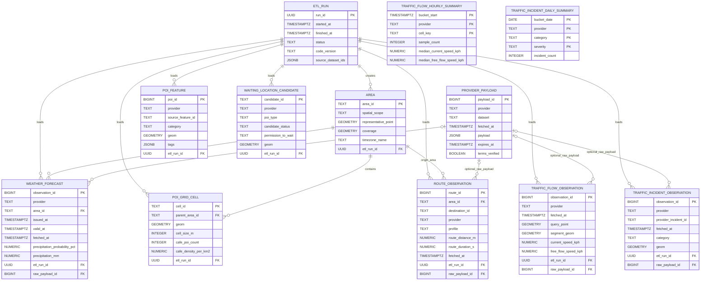

# Database design (MVP)

## Current status

The repository contains PostgreSQL/PostGIS migrations, a sample loader, and a local PostGIS service in [`compose.yaml`](../compose.yaml), plus an Engine adapter in [`data/engine_interface.py`](../data/engine_interface.py). Start the local service, apply migrations, and set `GIGCA_DATABASE_URL` before using it. Production database provisioning remains a deployment task. The existing JSON ETL remains available independently.

## Recommendation

Use PostgreSQL with the PostGIS extension for the MVP's repeated observations and spatial filtering. Do not put every dataset into one wide table: weather, POIs, route summaries, and traffic observations have different row meanings and update rates. Keep an optional raw-ingestion table for provider payloads, separate normalized tables for datasets, and let the Engine consume a stable JSON/API snapshot rather than provider-specific rows.

This is a spatial relational store, not a full star-schema data warehouse yet. Add analytical fact/dimension tables later if there is enough history and the team needs reporting across time.

## Tables and row grain

| Table | One row represents (grain) | MVP fields | Notes |
|---|---|---|---|
| `etl_run` | One execution of the data pipeline | `run_id`, `started_at`, `finished_at`, `status`, `code_version` | Tracks whether a snapshot is fresh and which run produced it. |
| `provider_payload` | One response captured from one provider request | `payload_id`, `provider`, `dataset`, `fetched_at`, `request_fingerprint`, `http_status`, `payload JSONB` | Optional raw staging. A non-null body requires `terms_verified=true` and an explicit expiry. Never store API secrets. |
| `area` | One configured Engine query area | `area_id`, scope, representative point, coverage geometry, timezone | Holds the location/grid/polygon envelope queried by the adapter. |
| `weather_forecast` | One provider's rain forecast for one area and valid time from one forecast issue | `provider`, `area_id`, `issued_at`, `valid_at`, `fetched_at`, `precipitation_probability_pct`, `precipitation_mm` | Unique key includes provider + area + issue + valid + fetch time, so repeated vintages remain distinguishable. Current scope is rain only. |
| `poi_feature` | One source POI feature | `provider`, `source_feature_id`, `category`, `name`, `geom`, `tags JSONB`, `fetched_at` | Deduplicate by provider and source feature ID. POI presence does not mean a driver may legally wait there. |
| `poi_grid_cell` | One cafe-density grid cell in one area | `cell_id`, `parent_area_id`, geometry, cafe count/density, coverage status | Keeps the sample's 250 m grain and null for incomplete 500 m neighborhoods. |
| `waiting_location_candidate` | One possible waiting place from a map source | `candidate_id`, source ID, candidate type/status, point, verification fields | Candidate only; permission remains unknown unless separately verified. |
| Road graph (future) | One directed road segment in a selected network version | `network_version`, `source_edge_id`, `from_node`, `to_node`, `geom`, `length_m`, `tags JSONB` | No road-edge table is migrated yet. Add it only with an agreed network source and verified access restrictions; `driving` is not a verified motorcycle route. |
| `traffic_flow_observation` | One Flow Segment response for the returned road segment at one fetch time | `provider`, `fetched_at`, `query_point`, `segment_geom`, `current_speed_kph`, `free_flow_speed_kph`, `current_travel_time_s`, `free_flow_travel_time_s`, `confidence`, `road_closed`, `functional_road_class`, `openlr`, `raw_payload_id` | One query point selects the closest segment; returned geometry is not the query point. Matching to a local road edge remains unimplemented. |
| `traffic_incident_observation` | One incident feature returned by one bbox request at one fetch time | `provider`, `provider_incident_id`, `fetched_at`, `category`, `delay_magnitude`, `delay_s`, `length_m`, `valid_from`, `valid_to`, `time_validity`, `geom`, `raw_payload_id` | Keep each poll as a time-stamped observation; the same incident may recur across polls. |
| `traffic_flow_hourly_summary` | One provider and coarse geohash cell in one hour | Sample count and median current/free-flow speed and ratio | Produced by retention when old detail is compacted. |
| `traffic_incident_daily_summary` | One provider/category/severity group in one day | Incident count, observed delay and affected length | Produced by retention before detail is deleted. |

The migrations create these tables. The checked-in loader populates `etl_run`, `area`, rain forecasts, POIs, cafe grid cells, waiting candidates, and route summaries from checked-in samples. The web flow can persist normalized TomTom Flow observations on an upstream `/api/traffic` fetch when the database is configured; this is request-triggered polling, not a stream. Incident observations are not currently part of that ingestion path. Store route responses as provider payloads only if terms allow; a route response is not a traffic observation.

## Entity relationship diagram

The diagram below follows the foreign keys in the current SQL migrations. Spatial containment is not shown as a relationship: for example, waiting-place candidates and traffic observations are associated with an area by spatial query, not by an `area_id` foreign key. The road graph is a future design and is not a migrated table.



`TRAFFIC_FLOW_HOURLY_SUMMARY` and `TRAFFIC_INCIDENT_DAILY_SUMMARY` are retention aggregates, so they do not reference the detail rows or an ETL run. Their compound primary keys are shown as multiple `PK` attributes.

## Realtime meaning and retention

The TomTom endpoints are request/response APIs, not a push stream. Each crawl is a snapshot with a `fetched_at` timestamp. TomTom documents that traffic flow and incident information is updated about once per minute, but GigCa sees updates only when its own ETL/backend polls; polling more often does not guarantee newer source data. Preserve snapshots as append-only observations rather than overwriting the previous speed or incident state. The provider's storage, cache, and retention terms still need confirmation before retaining history beyond local evaluation; current sample responses live in Git-ignored `data/raw/tomtom/`.

Temporal grains:

- `traffic_flow_observation`: one fetched response / returned road segment / fetch time. Store current and free-flow speeds together, plus confidence, `fetched_at`, query point, returned segment geometry, and raw-response reference. `openlr` can help identify segments if supplied; otherwise geometry matching is approximate.
- `traffic_incident_observation`: one incident in one fetched bbox response / fetch time. Store provider incident ID, category, delay severity, geometry, event times, and raw-response reference. Keep repeated appearances across polls so the system can estimate whether an incident is still present.
- `provider_payload`: one request/response, including endpoint version, fetch time, requested point or bbox, HTTP status, and the raw JSON. Never store the API key or a URL containing it.

Index observation tables on `(fetched_at)` and their geometries with GiST. The retention command uses the initial cutoffs below. A `current traffic` query should select the latest sufficiently fresh observation; an old observation should be labeled stale, not presented as current.

## Retention and compaction

Keeping every poll forever will make the database grow even when the project is not using the detailed history. Keep detailed rows briefly, roll traffic into smaller aggregates, then delete the detail. These are initial project defaults, not provider guarantees:

| Data | Detailed rows | Keep after compaction | Cleanup behavior |
|---|---|---|---|
| `provider_payload` | Do not persist response bodies unless provider terms allow it. If allowed, start with a 7-day TTL. | Request metadata and status only for the period needed to audit ETL. | Delete expired bodies after the provider-specific allowed period, whichever is shorter. Keep metadata without the body only if useful. |
| `traffic_flow_observation` | Keep 30 days of segment-level polls. | Hourly aggregates by coarse geohash cell: sample count, median speeds, and median current/free-flow ratio; keep 365 days. | The command writes/updates the aggregate, then deletes old segment-level observations. A geohash is not a matched road edge. |
| `traffic_incident_observation` | Keep 30 days of repeated incident observations. | Daily count and maximum observed delay/length by provider/category/severity; keep 365 days. | Aggregate distinct incident IDs by day, then delete detailed geometries and repeated poll rows. |
| `weather_forecast` | Keep vintages for at most 30 days after issue and valid times pass. | No rain rollup in this MVP. | Forecasts are not observed rainfall. |
| Route responses | Avoid storing full geometry by default; retain summaries for at most 7 days. | No route rollup in this MVP. | Delete route summaries when the short analysis window expires. |
| `poi_feature` | Keep latest deduplicated source snapshot. | Current POIs and cafe density per cell. | Update known IDs on refresh; historical POI versions are not retained by the sample loader. |

`python -m data.db.retention` compacts eligible traffic rows before deleting detail and records the run in `etl_run`. It is not scheduled automatically. Time partitioning is deferred until polling volume is known. Provider terms override these defaults: if caching or retention is not allowed, do not store that response. Do not retain driver IDs or precise driver traces for this MVP.

## What PostGIS adds

PostGIS is a PostgreSQL extension installed/enabled for a database, not a separate database or a UI add-on. Once the server has the extension installed, an administrator or database owner enables it with:

```sql
CREATE EXTENSION IF NOT EXISTS postgis;
```

It adds spatial column types such as `geometry(Point, 4326)` and `geometry(LineString, 4326)`, spatial functions such as distance/intersection checks, and spatial indexes. A GiST index can make nearby-POI searches fast:

```sql
CREATE INDEX poi_feature_geom_gix ON poi_feature USING GIST (geom);
```

For example, the backend can ask PostGIS for POIs inside a radius or forecast cells intersecting an area, instead of downloading every row and calculating distances itself. Ordinary fields still use regular PostgreSQL types and SQL. If PostGIS is unavailable on the chosen hosting plan, PostgreSQL can still store the non-spatial data, but spatial queries need another implementation.

## Data flow

```text
Provider API / saved sample JSON
    -> ETL run + optional provider payload (only if allowed)
    -> validate, normalize, deduplicate
    -> weather_forecast / poi_feature / poi_grid_cell / traffic observations
    -> data.engine_interface builds a versioned Engine input snapshot
```

The Engine input remains the shared contract in `contracts/engine_input.schema.json`; it should not depend on PostgreSQL table names. Forecast rows must carry issue time, valid time, provider, and freshness. Missing traffic data stays missing rather than being inferred from a route response.

## Remaining deployment and contract decisions

1. Which role/service owns the deployed database, credentials, migrations, backups, and scheduled retention command?
2. The sample uses one configured point area and 250 m OSM cafe cells; agree the production area/cell ID scheme.
3. Which traffic provider/fields are approved for ingestion? Traffic tables exist but the loader does not populate them.
4. Retention periods are initial project defaults; shorten them if provider terms require it and confirm that the summaries answer the research questions.
5. Which PostgreSQL host/plan supports PostGIS, backups, and the required storage region?

The Engine adapter emits the existing top-level `traffic[]` shape (`edge_id`, speeds in km/h, `observed_at`) from persisted traffic observations. The contract documents that these are provider segments, not graph-matched route edges. Incident observations remain `not_integrated` until the Engine adds an incident type and scorer.
