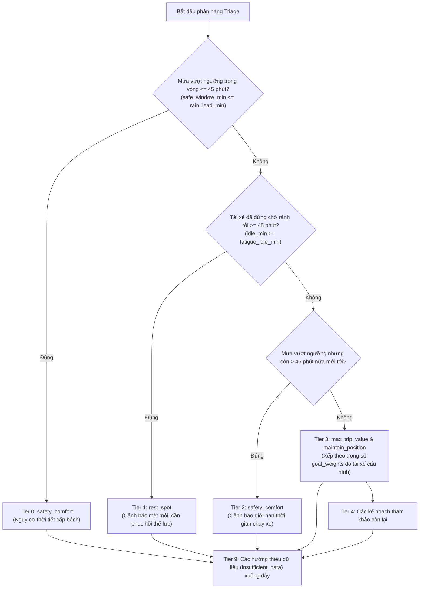

# Đặc Tả Công Thức Toán Học & Dữ Liệu Đầu Vào Của GigCa Decision Engine

Tài liệu này chuẩn hóa và giải thích chi tiết toàn bộ **công thức tính điểm định lượng**, **tham số cấu hình**, **danh mục dữ liệu đầu vào** và **điều kiện biên** cho cả 4 hướng quyết định chiến lược của hệ thống GigCa Decision Engine (phiên bản v2).

---

## 1. Triết Lý Tính Toán & Kỷ Luật Dữ Liệu Toàn Cục

### 1.1. Bốn Lăng Kính Chiến Lược Độc Lập
* Hệ thống **không bao giờ gộp 4 hướng thành 1 điểm số chung** (Tuân thủ *Spec Principle 3*). Một tài xế đang kiệt sức thì dù cuốc xe có doanh thu cao cũng không được ưu tiên hơn tính mạng và sự tỉnh táo.
* Mỗi hướng là một bộ tính toán độc lập ([`scorers/`](file:///c:/Users/Lenovo/Downloads/GigCa_upgraded/GigCa/engine/src/scorers/)), phản ánh một mục tiêu thực tế của tài xế xe công nghệ:
  1. `max_trip_value`: Tối ưu năng suất thu nhập ròng/giờ sau chi phí xăng cộ.
  2. `maintain_position`: Tối ưu điểm giữ vị trí vùng lõi, giảm thời gian chờ và quãng chạy rỗng.
  3. `rest_spot`: Tối ưu điểm phù hợp điểm nghỉ theo cự ly định tuyến thật và nhu cầu hồi sức.
  4. `safety_comfort`: Phòng vệ rủi ro thời tiết theo ngưỡng chịu mưa cá nhân và né các điểm nghẽn giao thông.

### 1.2. Kỷ Luật Dữ Liệu Vàng (The Golden Rule)
* **Thiếu dữ liệu $\neq 0$:** Nếu thiếu dữ liệu cước phí hoặc tỷ lệ trả khách, trường đó mang giá trị `None`. Engine **tuyệt đối không gán bằng 0**, không tự bịa ra giá cước hay khoảng cách.
* **Không suy diễn chéo (No Cross-Inference):** Không dùng số lượng quán cà phê để đoán nhu cầu khách đặt xe; không dùng vận tốc đường thông thoáng để đoán giá cước cuốc xe.
* **Báo cáo tường minh:** Khi một khu vực hay điểm nghỉ thiếu dữ liệu bắt buộc, ứng viên đó bị đưa vào danh sách `excluded` kèm lý do cụ thể hiển thị minh bạch cho tài xế.

---

## 2. Ma Trận Dữ Liệu Đầu Vào (Input Data Taxonomy)

| Nhóm Dữ Liệu | Nguồn Dữ Liệu Thật / Giả Lập | Các Trường Dữ Liệu Chính | Hướng Quyết Định Sử Dụng |
|---|---|---|:---:|
| **Bối cảnh tài xế (`DriverContext`)** | GPS thiết bị & Đồng hồ app tài xế | `current_lat`, `current_lng`, `idle_duration_min`, `horizon_min`, `max_reposition_km` | Cả 4 hướng |
| **Tùy chọn tài xế (`DriverPreferences`)** | Cài đặt cá nhân tài xế | `rain_tolerance_level` (`low`, `medium`, `high`), `goal_weights` | Hướng 4, Triage |
| **Dự báo thời tiết (`weather_hourly`)** | Thật: Open-Meteo API | `valid_time`, `precipitation_probability_pct`, `precipitation_mm` | Hướng 4 |
| **Điểm tiện ích (`poi_candidates`)** | Thật: OpenStreetMap / Overpass | `poi_id`, `name`, `category`, `subcategory`, `tags`, `opening_hours` | Hướng 3 |
| **Xác minh thực địa (`verified_places`)** | Khảo sát thực địa (Hiện là Mock) | `verified` (bool), `parking_allowed` (bool) | Hướng 3 |
| **Mẫu định tuyến (`routing_samples`)** | Thật: OSRM Routing Machine | `route_distance_m`, `route_duration_s`, `profile`, `origin_point`, `destination_id` | Hướng 3 |
| **Cước & Chuyến đi (`trip_value`)** | Nền tảng hãng xe (Hiện là Mock) | `net_value_vnd`, `gross_fare_vnd`, `avg_duration_min`, `demand_index`, `long_trip_rate_pct`, `avg_trip_distance_km`, `hotspot_features` | Hướng 1 |
| **Phân bố điểm đến (`destination_distribution`)** | Nền tảng hãng xe (Hiện là Mock) | `favorable_dropoff_pct`, `avg_next_wait_min` | Hướng 1, Hướng 2 |
| **Giao thông thời gian thực (`traffic_edges`)** | Cổng giao thông / GPS xe (Hiện là Mock) | `edge_id`, `name`, `current_speed_kmh`, `free_flow_speed_kmh`, `timestamp` | Hướng 4 |

---

## 3. Hướng 1: Săn Cuốc Cước Giá Trị Cao (`max_trip_value.py`)

### 3.1. Dữ Liệu Đầu Vào
* **Trường bắt buộc (`REQUIRED`):**
  * `trip_value.net_value_vnd`: Tiền cước ròng thực nhận của tài xế sau chiết khấu (VNĐ, yêu cầu $\ge 0$).
  * `trip_value.avg_duration_min`: Thời gian trung bình để hoàn thành cuốc xe (phút, yêu cầu $> 0$).
* **Trường tùy chọn bổ trợ:**
  * `destination_distribution.avg_next_wait_min`: Thời gian chờ trung bình để nổ cuốc kế (phút).
  * `trip_value.demand_index`: Chỉ số nhu cầu đặt xe (thang điểm chuẩn hóa, dùng cho Pareto).
  * `trip_value.long_trip_rate_pct`: Tỷ lệ phần trăm cuốc đi xa ($> 8\text{ km}$).
  * `trip_value.avg_trip_distance_km`: Cự ly di chuyển trung bình của cuốc xe (km).
  * `representative_point`: Tọa độ tâm khu vực `(lat, lng)` để tính chi phí dịch chuyển.

### 3.2. Mô Hình Toán Học & Công Thức Tính

#### A. Ước tính quãng đường & chi phí dịch chuyển (Repositioning)
Từ vị trí tài xế $(lat_1, lng_1)$ đến tâm khu vực $(lat_2, lng_2)$, khoảng cách đường chim bay $d_{\text{straight}}$ tính bằng công thức Haversine:
$$d_{\text{straight}} = 2 R \arcsin \left( \sqrt{\sin^2\left(\frac{\Delta \phi}{2}\right) + \cos(\phi_1)\cos(\phi_2)\sin^2\left(\frac{\Delta \lambda}{2}\right)} \right)$$

Ước tính cự ly chạy xe trên thực địa:
$$\text{reposition\_km} = \frac{d_{\text{straight}}}{1000} \times \text{detour\_factor}$$
*(Mặc định `detour_factor = 1.3`). Nếu $d_{\text{straight}} \le \text{at\_area\_radius\_m} = 500\text{m}$ thì $\text{reposition\_km} = 0$.)*

Thời gian và chi phí dịch chuyển tương ứng:
$$\text{reposition\_min} = \frac{\text{reposition\_km}}{\text{reposition\_speed\_kmh}} \times 60 \quad (\text{với } \text{speed} = 20.0\text{ km/h})$$
$$\text{reposition\_cost\_vnd} = \text{reposition\_km} \times \text{reposition\_cost\_vnd\_per\_km} \quad (\text{với đơn giá } = 2,000\text{ đ/km})$$

#### B. Công thức Năng suất Thu nhập Ròng theo Giờ (Yield)
$$\text{Yield (VNĐ/giờ)} = \frac{\text{Net Income}}{\text{Total Time (hours)}} = \frac{\text{net\_value\_vnd} - \text{reposition\_cost\_vnd}}{\dfrac{\text{avg\_duration\_min} + \text{reposition\_min} + \text{wait\_min}}{60}}$$

> [!IMPORTANT]
> **Quy tắc công bằng về thời gian chờ (`use_wait`):**
> Thành phần $\text{wait\_min}$ chỉ được cộng vào mẫu số nếu **100% các khu vực hợp lệ** đều có trường `avg_next_wait_min`. Nếu có dù chỉ 1 khu vực thiếu trường này, $\text{wait\_min}$ sẽ bị loại bỏ khỏi toàn bộ các ứng viên để bảo đảm tính so sánh công bằng.

### 3.3. Tối Ưu Pareto & Phân Tích Độ Nhạy (Robustness)
* **Kiểm định Pareto (`_pareto`):** Một khu vực $A$ là tối ưu Pareto trên không gian $(\text{Yield}, \text{demand\_index})$ nếu không tồn tại khu vực $B$ nào thỏa mãn:
  $$\text{Yield}(B) \ge \text{Yield}(A) \quad \text{VÀ} \quad \text{Demand}(B) \ge \text{Demand}(A)$$
  *(trong đó có ít nhất một bất đẳng thức thực sự lớn hơn).*
* **Phân tích độ nhạy Top-1 (`analyze_top1`):** Dao động từng tham số (`reposition_speed_kmh`, `reposition_cost_vnd_per_km`, `detour_factor`) một góc $\pm 20\%$ để kiểm tra tỷ lệ giữ vững ngôi đầu (`top1_share`). Nếu `top1_share` $< 0.8$, hệ thống cảnh báo xếp hạng có thể thay đổi khi điều kiện giao thông thay đổi.

### 3.4. Điều Kiện Loại Trừ (Exclusion Rules)
Khu vực bị loại trừ ngay khỏi bảng xếp hạng nếu:
1. Thiếu trường `net_value_vnd` hoặc `avg_duration_min`.
2. Giá trị `net_value_vnd < 0` hoặc `avg_duration_min <= 0`.
3. Không tính được tọa độ đại diện hợp lệ.
4. Quãng đường dịch chuyển vượt bán kính tối đa: $\text{reposition\_km} > \text{max\_reposition\_km}$.

---

## 4. Hướng 2: Bám Trụ Vùng Lõi & Vòng Quay Mau (`maintain_position.py`)

### 4.1. Dữ Liệu Đầu Vào
* **Trường bắt buộc (`REQUIRED`):**
  * `destination_distribution.favorable_dropoff_pct`: Tỷ lệ % các chuyến trả khách trong vùng lõi trung tâm ($0.0 \le x \le 100.0$).
  * `destination_distribution.avg_next_wait_min`: Thời gian chờ bình quân để đón cuốc tiếp theo tại khu vực này (phút, $x \ge 0$).
* **Trường tọa độ đại diện:** Để tính cự ly chạy rỗng $\text{reposition\_km}$ khi cần quay lại vùng lõi.

### 4.2. Mô Hình Toán Học & Công Thức Tính

#### Công thức Điểm Giữ Vị Trí (Position Score)
Điểm số phản ánh mức độ thuận lợi của khu vực để duy trì chuỗi chuyến đi liên tục, tính theo thang điểm chuẩn từ $0$ đến $100$:

$$\text{position\_score} = \operatorname{clamp}_{[0, 100]} \Big( \text{favorable\_dropoff\_pct} - (\alpha \times \text{avg\_next\_wait\_min}) - (\beta \times \text{reposition\_km}) \Big)$$

Trong đó:
* $\alpha = \text{wait\_penalty\_per\_min} = 1.5$ điểm phạt cho mỗi phút phải đứng chờ cuốc mới.
* $\beta = \text{reposition\_penalty\_per\_km} = 2.0$ điểm phạt cho mỗi kilomet chạy rỗng dịch chuyển đến khu vực.
* $\operatorname{clamp}_{[0, 100]}(s) = \max(0.0, \min(100.0, s))$.

### 4.3. Phân Tích Độ Nhạy (Robustness)
Hệ thống kiểm tra tính ổn định của khu vực dẫn đầu bằng cách biến thiên các hệ số phạt $\alpha$ và $\beta$ thêm $\pm 20\%$:
* Đo lường khoảng cách điểm số với vị trí thứ 2 (`margin_pct`):
  $$\text{margin\_pct} = \frac{\text{score}_1 - \text{score}_2}{\text{score}_1} \times 100\%$$
* Nếu $\text{margin\_pct} < 5.0\%$, đánh dấu là cạnh tranh sít sao (`contested = True`).

### 4.4. Điều Kiện Loại Trừ (Exclusion Rules)
1. Thiếu trường `favorable_dropoff_pct` hoặc `avg_next_wait_min`.
2. Giá trị ngoài miền hợp lệ: $\text{favorable\_dropoff\_pct} \notin [0, 100]$ hoặc $\text{avg\_next\_wait\_min} < 0$.
3. Cự ly dịch chuyển vượt quá ngưỡng của tài xế: $\text{reposition\_km} > \text{max\_reposition\_km}$.

---

## 5. Hướng 3: Nghỉ Ngơi & Nạp Năng Lượng (`rest_spot.py`)

### 5.1. Dữ Liệu Đầu Vào & Quy Tắc Định Tuyến Khắt Khe
* **Ứng viên điểm nghỉ (`poi_candidates`):** Danh mục phân loại chuẩn (`cafe`, `gas_station`, `parking`, `toilet`, `rest_area`), giờ mở cửa `opening_hours`, cờ xác minh `verified` và `parking_allowed`.
* **Mẫu định tuyến OSRM (`routing_samples`):** Bắt buộc phải có `route_distance_m` và `route_duration_s`.
* **Bộ lọc xuất phát gần (`usable_routing_samples`):** Chỉ chấp nhận mẫu định tuyến có điểm xuất phát cách vị trí thực tế của tài xế $\le \text{origin\_tolerance\_m} = 800\text{m}$.
  > [!CAUTION]
  > **Quy tắc bất biến:** Điểm POI nào không có mẫu định tuyến hợp lệ từ gần vị trí tài xế sẽ bị loại bỏ ngay lập tức. **Tuyệt đối không dùng cự ly đường chim bay Haversine để xếp hạng điểm nghỉ**.

### 5.2. Mô Hình Toán Học Tính Điểm Phù Hợp (Fit Score)

#### A. Công thức Xếp Hạng Chung (Rank Score)
$$\text{rank\_score} = \text{fit\_score} + \text{VERIFIED\_BONUS}$$
*(Trong đó $\text{VERIFIED\_BONUS} = 10.0$ nếu $\text{poi.verified} = \text{True}$; ngược lại $= 0.0$. Quy tắc này đảm bảo điểm có kiểm chứng thực địa luôn đứng trước điểm chưa kiểm chứng).*

#### B. Công thức Điểm Phù Hợp (Fit Score)
$$\text{fit\_score} = \frac{w_{\text{time}} \times \text{time\_score} + w_{\text{cat}} \times \text{category\_fit}}{w_{\text{time}} + w_{\text{cat}}}$$

Với tham số cấu hình: $w_{\text{time}} = 0.6$, $w_{\text{cat}} = 0.4$.

* **Hàm suy hao thời gian di chuyển (`time_score`):**
  $$\text{time\_score} = \frac{1}{1 + \dfrac{\text{duration\_s}}{\text{travel\_time\_ref\_s}}} \quad (\text{với } \text{travel\_time\_ref\_s} = 600\text{ giây} = 10\text{ phút})$$
  *(Thời gian di chuyển bằng 0 thì điểm $= 1.0$; di chuyển 10 phút thì điểm $= 0.5$; di chuyển càng lâu điểm càng tiến về 0).*

### 5.3. Ma Trận Thích Ứng Theo Thời Gian Chờ Rảnh Rỗi (`category_fit`)
Điểm số tiện ích tự động biến thiên theo thời gian tài xế đã dừng chờ rảnh rỗi (`idle_duration_min`), phản ánh trạng thái tâm sinh lý từ "dừng nhanh" sang "mệt mỏi cần hồi sức":

| Thể Loại Tiện Ích (`category`) | Rảnh Ngắn ($< 25\text{ phút}$) *(Nhu cầu giải quyết gấp)* | Rảnh Lâu ($\ge 25\text{ phút}$) *(Dấu hiệu mệt, cần nghỉ sâu)* |
|---|:---:|:---:|
| **Quán cafe (`cafe`)** | 0.8 | **1.0** (có chỗ ngồi, máy lạnh, sạc điện thoại) |
| **Trạm dừng chân (`rest_area`)** | 0.8 | **1.0** (không gian thoáng, ngả lưng) |
| **Bãi đỗ xe máy (`parking`)** | 0.6 | **0.8** (an tâm để xe không bị phạt) |
| **Cây xăng (`gas_station`)** | **1.0** (đổ xăng, rửa mặt nhanh) | 0.5 (không có chỗ ngả lưng) |
| **Nhà vệ sinh công cộng (`toilet`)** | **1.0** (giải quyết nhu cầu khẩn cấp) | 0.5 (không thể ngồi lâu) |

### 5.4. Thời Lượng Nghỉ & Giờ Mở Cửa
* **Thời lượng nghỉ khuyến nghị (`rest_duration_min`):**
  * $\text{idle\_duration\_min} < 25\text{ phút} \rightarrow \text{Nghỉ } 15\text{ phút}$.
  * $25 \le \text{idle\_duration\_min} < 45\text{ phút} \rightarrow \text{Nghỉ } 25\text{ phút}$.
  * $\text{idle\_duration\_min} \ge 45\text{ phút} \rightarrow \text{Nghỉ } 30\text{ phút}$.
* **Kiểm tra giờ mở cửa (`is_open_at`):**
  $$\text{arrival\_time} = \text{now\_local} + \text{timedelta}(\text{seconds}=\text{duration\_s})$$
  Nếu điểm nghỉ đóng cửa vào lúc $\text{arrival\_time}$, điểm đó bị loại ngay.
* **Phân tầng chất lượng (Suitability Tier):**
  * $\text{fit\_score} \ge 0.75 \rightarrow$ Tối ưu (`toi_uu`).
  * $0.50 \le \text{fit\_score} < 0.75 \rightarrow$ Khá (`kha`).
  * $\text{fit\_score} < 0.50 \rightarrow$ Tiêu chuẩn (`tieu_chuan`).

---

## 6. Hướng 4: Lưu Thông An Toàn — Né Mưa & Kẹt Xe (`safety_comfort.py`)

### 6.1. Dữ Liệu Thời Tiết & Thuật Toán Phân Tích Cửa Sổ An Toàn (`weather.py`)

#### A. Ngưỡng Chịu Mưa Cá Nhân (Rain Tolerance Thresholds)
So sánh dự báo từng giờ với mức chịu đựng cá nhân của tài xế (`rain_tolerance_level`):
* **Mức thấp (`low`):** Xác suất mưa $\ge 30.0\%$ HOẶC vũ lượng $\ge 0.5\text{ mm/h}$.
* **Mức trung bình (`medium`):** Xác suất mưa $\ge 55.0\%$ HOẶC vũ lượng $\ge 2.0\text{ mm/h}$.
* **Mức cao (`high`):** Xác suất mưa $\ge 75.0\%$ HOẶC vũ lượng $\ge 5.0\text{ mm/h}$.

#### B. Quy Ước Thời Gian & Tỷ Lệ Bao Phủ
* **Quy ước giờ Open-Meteo (`slot_convention = "preceding_hour"`):** Mốc dự báo `15:00` biểu diễn lượng mưa tích lũy từ `14:00` đến `15:00`.
* **Tỷ lệ bao phủ tối thiểu (`min_coverage_ratio = 0.5`):** Dữ liệu dự báo phải phủ tối thiểu $50\%$ khung thời gian xét (`horizon_min`). Nếu dưới $50\%$, phát tín hiệu `SIGNAL_UNKNOWN`.

#### C. Bốn Tín Hiệu Hành Động Thời Tiết (Weather Action Signal)
1. **`SIGNAL_NOW`:** Mưa vượt ngưỡng đang diễn ra ngay ở khung giờ hiện tại $\rightarrow$ Kế hoạch: Tấp vào nơi có mái che/cây xăng gần nhất, tạm dừng nhận cuốc.
2. **`SIGNAL_BEFORE`:** Khung giờ hiện tại an toàn, nhưng mưa vượt ngưỡng sẽ đến sau $T$ phút nữa:
   $$\text{safe\_window\_min} = T$$
   $$\text{cutoff\_min} = \min(T, \max(5, T - \text{pre\_rain\_buffer\_min})) \quad (\text{với buffer } = 15\text{ phút})$$
   Kế hoạch: Chỉ nhận cuốc ngắn kết thúc trước thời điểm $\text{cutoff\_min}$, mặc sẵn áo mưa và bọc điện thoại.
3. **`SIGNAL_OK`:** Toàn bộ khung thời gian $\text{horizon\_min}$ đều không vượt ngưỡng chịu mưa $\rightarrow$ Kế hoạch: An tâm lưu thông bình thường.
4. **`SIGNAL_UNKNOWN`:** Thiếu dữ liệu dự báo $\rightarrow$ Khuyến cáo tài xế tự quan sát bầu trời.

### 6.2. Dữ Liệu Giao Thông & Thuật Toán Phân Loại Luồng Đường (`traffic.py`)

#### A. Lọc độ tươi của dữ liệu (Data Freshness)
Một đoạn đường (`traffic_edge`) chỉ được xem là hợp lệ nếu độ trễ dữ liệu:
$$\text{age\_min} = \frac{\text{now\_local} - \text{edge.timestamp}}{60} \le \text{max\_age\_min} \quad (\text{mặc định } 30\text{ phút})$$

#### B. Chỉ số ùn tắc liên tục và nhãn hiển thị
Dữ liệu gốc là tốc độ số, không phải nhãn one-hot. Engine tính tỷ số và chỉ số CI trên từng đoạn:
$$\text{Speed Ratio} = \frac{v_{\text{current}}}{v_{\text{free\_flow}}}$$

$$\text{CI} = \max\left(0, \frac{v_{\text{free\_flow}} - v_{\text{current}}}{v_{\text{free\_flow}}}\right)$$

CI nằm trong [0, 1] với tốc độ hợp lệ; CI là `None` nếu thiếu tốc độ hoặc tốc độ tự do không dương. CI trung bình được tính theo chiều dài nếu mọi đoạn có `length_m` hợp lệ; nếu không, Engine báo rõ `segment_mean` (trung bình đều theo đoạn). Engine xuất CI trung bình và danh sách `traffic_segments_by_congestion` được xếp theo CI giảm dần trong `key_metrics`.

Nhãn chỉ là phần diễn giải cho người dùng, không thay dữ liệu liên tục. Các ngưỡng hiện tại vẫn là cấu hình ban đầu, chưa được hiệu chỉnh theo dữ liệu TP.HCM:

* **Hành lang thông thoáng (`smooth`):** $\text{Speed Ratio} \ge 0.8$.
* **Lưu thông chậm (`slow`):** $0.5 \le \text{Speed Ratio} < 0.8$.
* **Điểm đen ùn tắc (`congested`):** $\text{Speed Ratio} < 0.5$.

Các nhãn trên không khẳng định toàn khu vực hoặc tuyến đường bị ùn tắc. Khi dữ liệu chỉ có provider segment chưa map-match, chỉ diễn giải đúng các segment đã quan sát; CI không phải mật độ xe.

### 6.3. Ma Trận Kết Hợp An Toàn
Engine tạo các danh sách diễn giải để Backend/Frontend hiển thị, không tính lại tuyến đi:
* **Các segment có tốc độ gần tự do (`safe_corridors`):** Segment được gắn nhãn `smooth` theo ngưỡng cấu hình. Đây là quan sát giao thông, không phải cam kết tuyến đường an toàn hay lệnh điều hướng.
* **Các segment có tốc độ giảm (`avoid_zones`):** Segment được gắn nhãn `congested` hoặc `slow` theo ngưỡng cấu hình, cộng với khung mưa vượt ngưỡng nếu có. `traffic_segments_by_congestion` giữ CI số liên tục để hệ thống sắp xếp và giải thích mức độ thay vì chỉ còn nhãn.

---

## 7. Cơ Chế Phân Hạng Ưu Tiên Triage (`priority.py`)

Khi xuất kết quả ra màn hình cho tài xế, Engine sử dụng bộ quy tắc phân tầng tất định (Deterministic Triage Tiers) để quyết định **kế hoạch nào cần được tài xế chú ý đầu tiên**, hoàn toàn không cộng dồn điểm số:

*Quy tắc giải quyết đồng hạng (Tie-breaking):* Trong cùng một tầng Tier, hướng nào có trọng số ưu tiên `goal_weights` cao hơn sẽ đứng trước; nếu bằng nhau, giữ thứ tự mặc định: `max_trip_value` $\rightarrow$ `maintain_position` $\rightarrow$ `rest_spot` $\rightarrow$ `safety_comfort`.

---

## 8. Bảng Tra Cứu Toàn Bộ Tham Số Hệ Thống (`engine_config.json`)

Mọi hằng số toán học đều được tham số hóa tại [`config/engine_config.json`](file:///c:/Users/Lenovo/Downloads/GigCa_upgraded/GigCa/config/engine_config.json) (hoặc dự phòng tại [`engine/src/config.py`](file:///c:/Users/Lenovo/Downloads/GigCa_upgraded/GigCa/engine/src/config.py)):

| Tham Số | Giá Trị Mặc Định | Đơn Vị | Ý Nghĩa Nghiệp Vụ |
|---|:---:|:---:|---|
| **`geo.detour_factor`** | `1.3` | Hệ số | Hệ số quy đổi cự ly đường chim bay Haversine sang cự ly thực tế trên đường bộ |
| **`geo.reposition_speed_kmh`** | `20.0` | km/h | Vận tốc giả định của xe máy khi chạy rỗng xuyên khu vực |
| **`geo.reposition_cost_vnd_per_km`** | `2000` | VNĐ/km | Chi phí xăng cộ và hao mòn xe máy ước tính trên mỗi kilomet chạy rỗng |
| **`geo.at_area_radius_m`** | `500` | mét | Bán kính xem như tài xế đã ở ngay trong khu vực (cự ly chạy rỗng coi như $= 0$) |
| **`routing.origin_tolerance_m`** | `800` | mét | Khoảng cách tối đa từ tài xế đến điểm xuất phát của mẫu routing OSRM |
| **`max_trip_value.trip_accept_ratio`** | `0.8` | Hệ số | Ngưỡng cước ròng tối thiểu khuyên tài xế nhận ($80\%$ mức cước bình quân vùng) |
| **`max_trip_value.max_wait_min`** | `20` | phút | Giới hạn thời gian đứng chờ cuốc đi xa tối đa trước khi đổi chiến thuật |
| **`maintain_position.wait_penalty_per_min`** | `1.5` | điểm/phút | Điểm trừ trong Position Score cho mỗi phút đứng chờ cuốc kế |
| **`maintain_position.reposition_penalty_per_km`** | `2.0` | điểm/km | Điểm trừ trong Position Score cho mỗi kilomet chạy rỗng quay lại vùng lõi |
| **`rest_spot.travel_time_ref_s`** | `600` | giây | Thời gian di chuyển chuẩn (10 phút) để tính độ suy hao `time_score` |
| **`rest_spot.weights.travel_time`** | `0.6` | Trọng số | Trọng số của cự ly di chuyển trong hàm `fit_score` điểm nghỉ |
| **`rest_spot.weights.category_fit`** | `0.4` | Trọng số | Trọng số của thể loại tiện ích trong hàm `fit_score` điểm nghỉ |
| **`rest_spot.long_idle_min`** | `25` | phút | Mốc thời gian dừng rảnh rỗi để chuyển sang ma trận điểm nghỉ chuyên sâu |
| **`weather.pre_rain_buffer_min`** | `15` | phút | Khoảng đệm an toàn trừ hao trước khi đợt mưa thực sự bắt đầu |
| **`weather.min_coverage_ratio`** | `0.5` | Tỷ lệ | Tỷ lệ tối thiểu của khung thời gian phải có dự báo thời tiết |
| **`traffic.smooth_ratio`** | `0.8` | Tỷ số | Tỷ số tốc độ tối thiểu để đoạn đường được phân loại là Hành lang an toàn |
| **`traffic.congested_ratio`** | `0.5` | Tỷ số | Tỷ số tốc độ tối đa khiến đoạn đường bị phân loại là Điểm đen ùn tắc |
| **`traffic.max_age_min`** | `30` | phút | Giới hạn tuổi thọ của mẫu đo giao thông trước khi bị coi là dữ liệu cũ (stale) |
| **`priority.rain_lead_min`** | `45` | phút | Cửa sổ thời gian cảnh báo mưa kích hoạt Tier 0 khẩn cấp |
| **`priority.fatigue_idle_min`** | `45` | phút | Thời gian rảnh kích hoạt Tier 1 cảnh báo mệt mỏi |
| **`robustness.perturbation_pct`** | `20.0` | % | Tỷ lệ phần trăm biến thiên tham số khi chạy kiểm tra độ nhạy Top-1 |
| **`robustness.top1_share_min`** | `0.8` | Tỷ lệ | Tỷ lệ giữ vững vị trí dẫn đầu tối thiểu để kết luận bảng xếp hạng ổn định |
