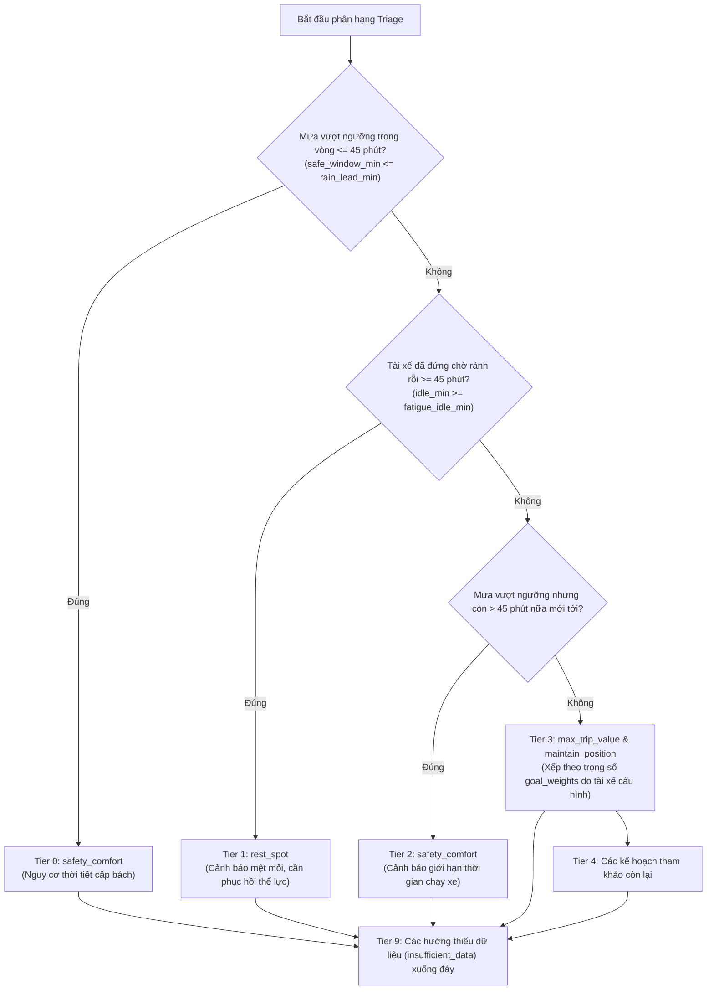

# Đặc Tả Công Thức Toán Học & Dữ Liệu Đầu Vào Của GigCa Decision Engine

Tài liệu này chuẩn hóa và giải thích chi tiết toàn bộ **công thức tính điểm định lượng**, **tham số cấu hình**, **danh mục dữ liệu đầu vào** và **điều kiện biên** cho cả 4 hướng quyết định chiến lược của hệ thống GigCa Decision Engine (phiên bản v2).

---

## 1. Triết Lý Tính Toán & Kỷ Luật Dữ Liệu Toàn Cục

### 1.1. Bốn Lăng Kính Chiến Lược Độc Lập
* Hệ thống **không bao giờ gộp 4 hướng thành 1 điểm số chung** (Tuân thủ *Spec Principle 3*). Một tài xế đang kiệt sức thì dù cuốc xe có doanh thu cao cũng không được ưu tiên hơn tính mạng và sự tỉnh táo.
* Mỗi hướng là một bộ tính toán độc lập ([`scorers/`](file:///c:/Users/Lenovo/Downloads/GigCa_upgraded/GigCa/engine/src/scorers/)), phản ánh một mục tiêu thực tế của tài xế xe công nghệ:
  1. `max_trip_value`: Tối ưu năng suất thu nhập ròng/giờ sau chi phí xăng cộ.
  2. `maintain_position`: Tối ưu điểm giữ vị trí vùng lõi, giảm thời gian chờ và quãng chạy rỗng.
  3. `rest_spot`: Tối ưu điểm phù hợp điểm nghỉ theo cự ly định tuyến thật và nhu cầu hồi sức.
  4. `safety_comfort`: Phòng vệ rủi ro thời tiết theo ngưỡng chịu mưa cá nhân và né các điểm nghẽn giao thông.

### 1.2. Kỷ Luật Dữ Liệu Vàng (The Golden Rule)
* **Thiếu dữ liệu $\neq 0$:** Nếu thiếu dữ liệu cước phí hoặc tỷ lệ trả khách, trường đó mang giá trị `None`. Engine **tuyệt đối không gán bằng 0**, không tự bịa ra giá cước hay khoảng cách.
* **Không suy diễn chéo (No Cross-Inference):** Không dùng số lượng quán cà phê để đoán nhu cầu khách đặt xe; không dùng vận tốc đường thông thoáng để đoán giá cước cuốc xe.
* **Báo cáo tường minh:** Khi một khu vực hay điểm nghỉ thiếu dữ liệu bắt buộc, ứng viên đó bị đưa vào danh sách `excluded` kèm lý do cụ thể hiển thị minh bạch cho tài xế.

---

## 2. Ma Trận Dữ Liệu Đầu Vào (Input Data Taxonomy)

| Nhóm Dữ Liệu | Nguồn Dữ Liệu Thật / Giả Lập | Các Trường Dữ Liệu Chính | Hướng Quyết Định Sử Dụng |
|---|---|---|:---:|
| **Bối cảnh tài xế (`DriverContext`)** | GPS thiết bị & Đồng hồ app tài xế | `current_lat`, `current_lng`, `idle_duration_min`, `horizon_min`, `max_reposition_km` | Cả 4 hướng |
| **Tùy chọn tài xế (`DriverPreferences`)** | Cài đặt cá nhân tài xế | `rain_tolerance_level` (`low`, `medium`, `high`), `goal_weights` | Hướng 4, Triage |
| **Dự báo thời tiết (`weather_hourly`)** | Thật: Open-Meteo API | `valid_time`, `precipitation_probability_pct`, `precipitation_mm` | Hướng 4 |
| **Điểm tiện ích (`poi_candidates`)** | Thật: OpenStreetMap / Overpass | `poi_id`, `name`, `category`, `subcategory`, `tags`, `opening_hours` | Hướng 3 |
| **Xác minh thực địa (`verified_places`)** | Khảo sát thực địa (Hiện là Mock) | `verified` (bool), `parking_allowed` (bool) | Hướng 3 |
| **Mẫu định tuyến (`routing_samples`)** | Thật: OSRM Routing Machine | `route_distance_m`, `route_duration_s`, `profile`, `origin_point`, `destination_id` | Hướng 3 |
| **Biểu cước (`tariff`)** | Bảng giá công bố, ghi trong `config/engine_config.json` kèm `source` | `fare_base_vnd` 12.500 cho `fare_base_km` 2 km đầu, `fare_per_km_vnd` 4.300, `fare_per_min_vnd` 350 (phút di chuyển sau 2 km), `driver_share` 0,75 (giả định cố định; thực tế 0,5–0,75) | Hướng 1, what-if |
| **Hồ sơ tài xế (`driver_profile`)** | Do CHÍNH tài xế nhập | `fare_base_vnd` (a), `fare_per_km_vnd` (b), `fare_base_km`, `fare_per_min_vnd`, `driver_share` (đều tùy chọn — thiếu thì dùng `tariff`, có nhãn), `fuel_l_per_100km`, `fuel_price_vnd_per_l` (→ c; thiếu thì dùng cấu hình, có nhãn), `target_vnd_per_hour` | Hướng 1 |
| **Nhật ký chuyến (`trip_log`)** | Do CHÍNH tài xế THẬT ghi (thử nghiệm có đồng ý), nhập bằng `data/driver_log_import.py` | Bắt buộc: `trip_id`, `started_at`, `pickup_lat/lng`, `net_vnd` (sau phí sàn, trước xăng, không gồm thưởng/tip), `duration_min` > 0. Tùy chọn: `dropoff_lat/lng`, `distance_km`. Thiếu trường bắt buộc → loại và đếm | Hướng 1 |
| **Đợt chờ (`wait_spells`)** | App companion / GPS / tài xế ghi giờ | Bắt buộc: `spell_id`, `start`, `end` (≥ start), `lat`, `lng`, `ended_by` (`trip`/`offline`/`moved`; hai loại sau là bị kiểm duyệt). Tùy chọn: `rain_mm` (chỉ cho ML) | Hướng 1, Hướng 2 |
| **Giao thông thời gian thực (`traffic_edges`)** | Cổng giao thông / GPS xe (Hiện là Mock) | `edge_id`, `name`, `current_speed_kmh`, `free_flow_speed_kmh`, `timestamp` | Hướng 4 |

---

## 3. Hướng 1: Săn Cuốc Giá Trị Cao (`max_trip_value.py`)

Engine KHÔNG đọc dữ liệu thị trường do sàn định nghĩa (cước gộp/ròng khu vực, `demand_index`, tỷ lệ cuốc xa, thời gian chờ khu vực…): không có API, không kiểm chứng được. Adapter xóa các trường này và báo số lượng đã xóa. Chỉ dùng dữ liệu tài xế tự kiểm chứng được.

### 3.1. Dữ Liệu Đầu Vào
* **Biểu cước khách trả** (công bố, trong `tariff`; tài xế nhập thì ghi đè từng trường): $a$ = 12.500đ cho $k_0$ = 2 km đầu, $b$ = 4.300đ/km tiếp theo, $m$ = 350đ mỗi phút di chuyển sau $k_0$. **Tỷ lệ tài xế nhận** $s$ = 0,75 (giả định cố định của nhóm; thực tế 0,5–0,75 — engine báo thêm năng suất ở $s$ = 0,5). Biểu cước KHÔNG còn được fit từ nhật ký.
* Xăng $c$ (đ/km) = lít/100km × giá xăng / 100; thiếu thì dùng `geo.reposition_cost_vnd_per_km` và ghi nhãn.
* Theo vùng $z$ (ô lưới từ nhật ký THẬT, co Bayes về trung bình cá nhân): `avg_trip_distance_km` $\bar d_z$, `avg_speed_kmh` $v_z$, thời gian chờ kỳ vọng $w_z$ (survival; vùng chưa đủ đợt chờ dùng mức chờ trung bình chung, có ghi nhãn).
* `representative_point` để ước tính dịch chuyển $r_z$ (đường chim bay × `detour_factor`, không phải routing).

### 3.2. Công thức
$$\text{Cước khách}(d, v) = a + b\,(d-k_0)^+ + m\,\frac{(d-k_0)^+}{v}\cdot 60 \qquad \text{Tiền nhận}(d, v) = s\cdot\text{Cước khách}(d, v)$$
$$\text{Thu nhập/chuyến} = \text{Tiền nhận}(\bar d_z, v_z) - c\,\bar d_z - c\,r_z \qquad \text{Giờ/chuyến} = \frac{\bar d_z}{v_z} + \frac{r_z}{v_{rep}} + \frac{w_z}{60}$$
$$\text{Yield (đ/giờ)} = \frac{\text{Thu nhập/chuyến}}{\text{Giờ/chuyến}}$$
Số phút tính phí là phút **di chuyển** sau $k_0$, ước tính bằng quãng còn lại / tốc độ chuyến (tốc độ học từ nhật ký; ở bảng what-if là giả định cấu hình 22 km/h, có nhãn). Xăng được trừ cho cả chặng chở khách và chặng chạy rỗng. Số hạng chờ chỉ dùng khi MỌI vùng đều có giá trị chờ.

**Ngưỡng nhận cuốc:** tiền nhận tối thiểu $= \text{mục tiêu đ/giờ} \times (t_{chuyến} + w)/60 + c\cdot d$; cước khách trả tương ứng $=$ tiền nhận tối thiểu $/ s$. Engine so với cước theo biểu cước cho cùng cự ly (đạt / chưa đạt) và nêu mỗi km thêm cần bao nhiêu so với biểu cước trả thêm $s\,(b + 60m/v)$.

**Đối chiếu tỷ lệ nhận (khi có ≥ 20 chuyến có cự ly thật):** $\hat s = \text{median}\big(\text{net\_vnd} / \text{Cước khách}(d, \text{phút thật})\big)$ với phút tính phí $=$ `duration_min` $\times (d-k_0)^+/d$. Lệch hơn `tariff.share_check_tolerance` (0,10) so với $s$ ⇒ cảnh báo (thưởng/tip lẫn trong net, loại xe khác, chương trình khác).

**Bảng what-if (Bậc 0, không cần nhật ký):** lưới cự ly × thời gian chờ → cước khách, tiền nhận, đ/giờ sau xăng, đ/giờ nếu $s$ = 0,5, tiền nhận/cước khách tối thiểu để đạt mục tiêu, và cự ly tối thiểu đạt mục tiêu cho từng mức chờ.

### 3.3. Pareto & độ nhạy
* Pareto trên $(\text{Yield}, \text{P10 của Yield})$ — lợi nhuận vs độ chắc ăn. P10–P90 chỉ lan truyền dao động mẫu của cự ly và thời gian chờ trung bình vùng.
* `analyze_top1` dao động `reposition_speed_kmh`, chi phí xăng, `detour_factor` $\pm 20\%$.

### 3.4. Loại trừ
Thiếu `avg_trip_distance_km`/`avg_speed_kmh`, giá trị $\le 0$, thiếu tọa độ đại diện, hoặc $r_z >$ `max_reposition_km`. Chưa có nhật ký thật thì cả hướng là `insufficient_data`, kèm bảng what-if theo biểu cước.

---

## 4. Hướng 2: Giữ Vị Trí Thuận Lợi (`maintain_position.py`)

### 4.1. Dữ Liệu Đầu Vào
Từ các đợt chờ của tài xế, theo vùng, bằng Kaplan–Meier (đợt kết thúc vì `offline`/`moved` là bị kiểm duyệt nên giờ nghỉ trưa không còn bị tính là chờ):
* `p_wait_le_pct` — $100\cdot P(\text{chờ} \le t)$ với các ngưỡng `maintain_position.wait_thresholds_min` (mặc định 10 và 20 phút);
* `expected_wait_min` — thời gian chờ kỳ vọng trong khung `wait_horizon_min`; `median_wait_min` (None nếu chưa đạt 50%).

### 4.2. Công thức
$$\text{position\_score} = \operatorname{clamp}_{[0,100]}\big(100\,P(\text{chờ}\le t_0) - \alpha\,w_z - \beta\,r_z\big)$$
$\alpha = 1.5$ điểm/phút, $\beta = 2.0$ điểm/km (tham số tạm, chưa hiệu chỉnh). Thay cho `favorable_dropoff_pct` cũ vốn trộn cầu với nơi tài xế chọn đi.

### 4.3. Độ nhạy
Biến thiên $\alpha, \beta$ $\pm 20\%$; `margin_pct` $< 5\%$ ⇒ cạnh tranh sít sao.

### 4.4. Loại trừ
Thiếu `p_wait_le_pct[t0]` hoặc `expected_wait_min`, giá trị ngoài miền, hoặc vượt `max_reposition_km`.

### 4.5. Thang sẵn sàng dữ liệu
Bậc 0: chưa có nhật ký — bảng what-if + ngưỡng hòa vốn từ biểu cước công bố (hoặc tài xế nhập). Bậc 1: $\ge 20$ chuyến thật — học cự ly/tốc độ theo vùng, xếp hạng vùng (độ tin cậy thấp), đối chiếu tỷ lệ nhận. Bậc 2: $\ge 20$ đợt chờ — survival, Hướng 2. Bậc 3 (cộng đồng, k-ẩn danh): chưa có trong engine.

---

### 4.6. Lớp ML tùy chọn (v5)
Khi đủ dữ liệu và thắng cổng backtest, `P(chờ ≤ t)` và chờ kỳ vọng của Hướng 1/2 do mô hình hazard rời rạc tính cho giờ/mưa/vị trí hiện tại:
$$h_k = P(\text{có cuốc trong ô } k \mid \text{còn chờ}, x), \quad S(t_k)=\prod_{j<k}(1-h_j), \quad P(\text{chờ}\le t)=1-S(t)$$
Đợt chờ kết thúc vì `offline`/`moved` chỉ đóng góp các ô đã sống sót (kiểm duyệt). Mô hình chỉ học trên nhật ký THẬT; không có dữ liệu huấn luyện mô phỏng. Chi tiết và cổng: `engine/README.md` (mục "Lớp ML").

---

## 5. Hướng 3: Nghỉ Ngơi & Nạp Năng Lượng (`rest_spot.py`)

### 5.1. Dữ Liệu Đầu Vào & Quy Tắc Định Tuyến Khắt Khe
* **Ứng viên điểm nghỉ (`poi_candidates`):** Danh mục phân loại chuẩn (`cafe`, `gas_station`, `parking`, `toilet`, `rest_area`), giờ mở cửa `opening_hours`, cờ xác minh `verified` và `parking_allowed`.
* **Mẫu định tuyến OSRM (`routing_samples`):** Bắt buộc phải có `route_distance_m` và `route_duration_s`.
* **Bộ lọc xuất phát gần (`usable_routing_samples`):** Chỉ chấp nhận mẫu định tuyến có điểm xuất phát cách vị trí thực tế của tài xế $\le \text{origin\_tolerance\_m} = 800\text{m}$.
  > [!CAUTION]
  > **Quy tắc bất biến:** Điểm POI nào không có mẫu định tuyến hợp lệ từ gần vị trí tài xế sẽ bị loại bỏ ngay lập tức. **Tuyệt đối không dùng cự ly đường chim bay Haversine để xếp hạng điểm nghỉ**.

### 5.2. Mô Hình Toán Học Tính Điểm Phù Hợp (Fit Score)

#### A. Công thức Xếp Hạng Chung (Rank Score)
$$\text{rank\_score} = \text{fit\_score} + \text{VERIFIED\_BONUS}$$
*(Trong đó $\text{VERIFIED\_BONUS} = 10.0$ nếu $\text{poi.verified} = \text{True}$; ngược lại $= 0.0$. Quy tắc này đảm bảo điểm có kiểm chứng thực địa luôn đứng trước điểm chưa kiểm chứng).*

#### B. Công thức Điểm Phù Hợp (Fit Score)
$$\text{fit\_score} = \frac{w_{\text{time}} \times \text{time\_score} + w_{\text{cat}} \times \text{category\_fit}}{w_{\text{time}} + w_{\text{cat}}}$$

Với tham số cấu hình: $w_{\text{time}} = 0.6$, $w_{\text{cat}} = 0.4$.

* **Hàm suy hao thời gian di chuyển (`time_score`):**
  $$\text{time\_score} = \frac{1}{1 + \dfrac{\text{duration\_s}}{\text{travel\_time\_ref\_s}}} \quad (\text{với } \text{travel\_time\_ref\_s} = 600\text{ giây} = 10\text{ phút})$$
  *(Thời gian di chuyển bằng 0 thì điểm $= 1.0$; di chuyển 10 phút thì điểm $= 0.5$; di chuyển càng lâu điểm càng tiến về 0).*

### 5.3. Ma Trận Thích Ứng Theo Thời Gian Chờ Rảnh Rỗi (`category_fit`)
Điểm số tiện ích tự động biến thiên theo thời gian tài xế đã dừng chờ rảnh rỗi (`idle_duration_min`), phản ánh trạng thái tâm sinh lý từ "dừng nhanh" sang "mệt mỏi cần hồi sức":

| Thể Loại Tiện Ích (`category`) | Rảnh Ngắn ($< 25\text{ phút}$) *(Nhu cầu giải quyết gấp)* | Rảnh Lâu ($\ge 25\text{ phút}$) *(Dấu hiệu mệt, cần nghỉ sâu)* |
|---|:---:|:---:|
| **Quán cafe (`cafe`)** | 0.8 | **1.0** (có chỗ ngồi, máy lạnh, sạc điện thoại) |
| **Trạm dừng chân (`rest_area`)** | 0.8 | **1.0** (không gian thoáng, ngả lưng) |
| **Bãi đỗ xe máy (`parking`)** | 0.6 | **0.8** (an tâm để xe không bị phạt) |
| **Cây xăng (`gas_station`)** | **1.0** (đổ xăng, rửa mặt nhanh) | 0.5 (không có chỗ ngả lưng) |
| **Nhà vệ sinh công cộng (`toilet`)** | **1.0** (giải quyết nhu cầu khẩn cấp) | 0.5 (không thể ngồi lâu) |

### 5.4. Thời Lượng Nghỉ & Giờ Mở Cửa
* **Thời lượng nghỉ khuyến nghị (`rest_duration_min`):**
  * $\text{idle\_duration\_min} < 25\text{ phút} \rightarrow \text{Nghỉ } 15\text{ phút}$.
  * $25 \le \text{idle\_duration\_min} < 45\text{ phút} \rightarrow \text{Nghỉ } 25\text{ phút}$.
  * $\text{idle\_duration\_min} \ge 45\text{ phút} \rightarrow \text{Nghỉ } 30\text{ phút}$.
* **Kiểm tra giờ mở cửa (`is_open_at`):**
  $$\text{arrival\_time} = \text{now\_local} + \text{timedelta}(\text{seconds}=\text{duration\_s})$$
  Nếu điểm nghỉ đóng cửa vào lúc $\text{arrival\_time}$, điểm đó bị loại ngay.
* **Phân tầng chất lượng (Suitability Tier):**
  * $\text{fit\_score} \ge 0.75 \rightarrow$ Tối ưu (`toi_uu`).
  * $0.50 \le \text{fit\_score} < 0.75 \rightarrow$ Khá (`kha`).
  * $\text{fit\_score} < 0.50 \rightarrow$ Tiêu chuẩn (`tieu_chuan`).

---

## 6. Hướng 4: Lưu Thông An Toàn — Né Mưa & Kẹt Xe (`safety_comfort.py`)

### 6.1. Dữ Liệu Thời Tiết & Thuật Toán Phân Tích Cửa Sổ An Toàn (`weather.py`)

#### A. Ngưỡng Chịu Mưa Cá Nhân (Rain Tolerance Thresholds)
So sánh dự báo từng giờ với mức chịu đựng cá nhân của tài xế (`rain_tolerance_level`):
* **Mức thấp (`low`):** Xác suất mưa $\ge 30.0\%$ HOẶC vũ lượng $\ge 0.5\text{ mm/h}$.
* **Mức trung bình (`medium`):** Xác suất mưa $\ge 55.0\%$ HOẶC vũ lượng $\ge 2.0\text{ mm/h}$.
* **Mức cao (`high`):** Xác suất mưa $\ge 75.0\%$ HOẶC vũ lượng $\ge 5.0\text{ mm/h}$.

#### B. Quy Ước Thời Gian & Tỷ Lệ Bao Phủ
* **Quy ước giờ Open-Meteo (`slot_convention = "preceding_hour"`):** Mốc dự báo `15:00` biểu diễn lượng mưa tích lũy từ `14:00` đến `15:00`.
* **Tỷ lệ bao phủ tối thiểu (`min_coverage_ratio = 0.5`):** Dữ liệu dự báo phải phủ tối thiểu $50\%$ khung thời gian xét (`horizon_min`). Nếu dưới $50\%$, phát tín hiệu `SIGNAL_UNKNOWN`.

#### C. Bốn Tín Hiệu Hành Động Thời Tiết (Weather Action Signal)
1. **`SIGNAL_NOW`:** Mưa vượt ngưỡng đang diễn ra ngay ở khung giờ hiện tại $\rightarrow$ Kế hoạch: Tấp vào nơi có mái che/cây xăng gần nhất, tạm dừng nhận cuốc.
2. **`SIGNAL_BEFORE`:** Khung giờ hiện tại an toàn, nhưng mưa vượt ngưỡng sẽ đến sau $T$ phút nữa:
   $$\text{safe\_window\_min} = T$$
   $$\text{cutoff\_min} = \min(T, \max(5, T - \text{pre\_rain\_buffer\_min})) \quad (\text{với buffer } = 15\text{ phút})$$
   Kế hoạch: Chỉ nhận cuốc ngắn kết thúc trước thời điểm $\text{cutoff\_min}$, mặc sẵn áo mưa và bọc điện thoại.
3. **`SIGNAL_OK`:** Toàn bộ khung thời gian $\text{horizon\_min}$ đều không vượt ngưỡng chịu mưa $\rightarrow$ Kế hoạch: An tâm lưu thông bình thường.
4. **`SIGNAL_UNKNOWN`:** Thiếu dữ liệu dự báo $\rightarrow$ Khuyến cáo tài xế tự quan sát bầu trời.

### 6.2. Dữ Liệu Giao Thông & Thuật Toán Phân Loại Luồng Đường (`traffic.py`)

#### A. Lọc độ tươi của dữ liệu (Data Freshness)
Một đoạn đường (`traffic_edge`) chỉ được xem là hợp lệ nếu độ trễ dữ liệu:
$$\text{age\_min} = \frac{\text{now\_local} - \text{edge.timestamp}}{60} \le \text{max\_age\_min} \quad (\text{mặc định } 30\text{ phút})$$

#### B. Chỉ số ùn tắc liên tục và nhãn hiển thị
Dữ liệu gốc là tốc độ số, không phải nhãn one-hot. Engine tính tỷ số và chỉ số CI trên từng đoạn:
$$\text{Speed Ratio} = \frac{v_{\text{current}}}{v_{\text{free\_flow}}}$$

$$\text{CI} = \max\left(0, \frac{v_{\text{free\_flow}} - v_{\text{current}}}{v_{\text{free\_flow}}}\right)$$

CI nằm trong [0, 1] với tốc độ hợp lệ; CI là `None` nếu thiếu tốc độ hoặc tốc độ tự do không dương. CI trung bình được tính theo chiều dài nếu mọi đoạn có `length_m` hợp lệ; nếu không, Engine báo rõ `segment_mean` (trung bình đều theo đoạn). Engine xuất CI trung bình và danh sách `traffic_segments_by_congestion` được xếp theo CI giảm dần trong `key_metrics`.

Nhãn chỉ là phần diễn giải cho người dùng, không thay dữ liệu liên tục. Các ngưỡng hiện tại vẫn là cấu hình ban đầu, chưa được hiệu chỉnh theo dữ liệu TP.HCM:

* **Hành lang thông thoáng (`smooth`):** $\text{Speed Ratio} \ge 0.8$.
* **Lưu thông chậm (`slow`):** $0.5 \le \text{Speed Ratio} < 0.8$.
* **Điểm đen ùn tắc (`congested`):** $\text{Speed Ratio} < 0.5$.

Các nhãn trên không khẳng định toàn khu vực hoặc tuyến đường bị ùn tắc. Khi dữ liệu chỉ có provider segment chưa map-match, chỉ diễn giải đúng các segment đã quan sát; CI không phải mật độ xe.

### 6.3. Ma Trận Kết Hợp An Toàn
Engine tạo các danh sách diễn giải để Backend/Frontend hiển thị, không tính lại tuyến đi:
* **Các segment có tốc độ gần tự do (`safe_corridors`):** Segment được gắn nhãn `smooth` theo ngưỡng cấu hình. Đây là quan sát giao thông, không phải cam kết tuyến đường an toàn hay lệnh điều hướng.
* **Các segment có tốc độ giảm (`avoid_zones`):** Segment được gắn nhãn `congested` hoặc `slow` theo ngưỡng cấu hình, cộng với khung mưa vượt ngưỡng nếu có. `traffic_segments_by_congestion` giữ CI số liên tục để hệ thống sắp xếp và giải thích mức độ thay vì chỉ còn nhãn.

---

## 7. Cơ Chế Phân Hạng Ưu Tiên Triage (`priority.py`)

Khi xuất kết quả ra màn hình cho tài xế, Engine sử dụng bộ quy tắc phân tầng tất định (Deterministic Triage Tiers) để quyết định **kế hoạch nào cần được tài xế chú ý đầu tiên**, hoàn toàn không cộng dồn điểm số:

*Quy tắc giải quyết đồng hạng (Tie-breaking):* Trong cùng một tầng Tier, hướng nào có trọng số ưu tiên `goal_weights` cao hơn sẽ đứng trước; nếu bằng nhau, giữ thứ tự mặc định: `max_trip_value` $\rightarrow$ `maintain_position` $\rightarrow$ `rest_spot` $\rightarrow$ `safety_comfort`.

---

## 8. Bảng Tra Cứu Toàn Bộ Tham Số Hệ Thống (`engine_config.json`)

Mọi hằng số toán học đều được tham số hóa tại [`config/engine_config.json`](file:///c:/Users/Lenovo/Downloads/GigCa_upgraded/GigCa/config/engine_config.json) (hoặc dự phòng tại [`engine/src/config.py`](file:///c:/Users/Lenovo/Downloads/GigCa_upgraded/GigCa/engine/src/config.py)):

| Tham Số | Giá Trị Mặc Định | Đơn Vị | Ý Nghĩa Nghiệp Vụ |
|---|:---:|:---:|---|
| **`geo.detour_factor`** | `1.3` | Hệ số | Hệ số quy đổi cự ly đường chim bay Haversine sang cự ly thực tế trên đường bộ |
| **`geo.reposition_speed_kmh`** | `20.0` | km/h | Vận tốc giả định của xe máy khi chạy rỗng xuyên khu vực |
| **`geo.reposition_cost_vnd_per_km`** | `2000` | VNĐ/km | Chi phí xăng dự phòng khi tài xế chưa nhập lít/100km và giá xăng (có nhãn) |
| **`tariff.fare_base_vnd` / `fare_base_km`** | `12500` / `2` | VNĐ / km | Giá mở cửa trọn gói cho 2 km đầu (bảng giá công bố) |
| **`tariff.fare_per_km_vnd`** | `4300` | VNĐ/km | Đơn giá mỗi km tiếp theo |
| **`tariff.fare_per_min_vnd`** | `350` | VNĐ/phút | Phụ phí mỗi phút di chuyển sau 2 km đầu |
| **`tariff.driver_share`** | `0.75` | Tỷ lệ | Phần cước tài xế nhận (giả định cố định; `driver_share_range` = [0.5, 0.75] dùng cho độ nhạy) |
| **`tariff.share_check_tolerance`** | `0.10` | Tỷ lệ | Lệch tối đa giữa tỷ lệ nhận quan sát từ nhật ký và `driver_share` trước khi cảnh báo |
| **`geo.at_area_radius_m`** | `500` | mét | Bán kính xem như tài xế đã ở ngay trong khu vực (cự ly chạy rỗng coi như $= 0$) |
| **`routing.origin_tolerance_m`** | `800` | mét | Khoảng cách tối đa từ tài xế đến điểm xuất phát của mẫu routing OSRM |
| **`what_if.assumed_trip_speed_kmh`** | `22.0` | km/h | Giả định tốc độ cuốc cho bảng what-if Bậc 0 (chưa có nhật ký để học) |
| **`max_trip_value.max_wait_min`** | `20` | phút | Giới hạn thời gian đứng chờ cuốc đi xa tối đa trước khi đổi chiến thuật |
| **`maintain_position.wait_penalty_per_min`** | `1.5` | điểm/phút | Điểm trừ trong Position Score cho mỗi phút đứng chờ cuốc kế |
| **`maintain_position.reposition_penalty_per_km`** | `2.0` | điểm/km | Điểm trừ trong Position Score cho mỗi kilomet chạy rỗng quay lại vùng lõi |
| **`rest_spot.travel_time_ref_s`** | `600` | giây | Thời gian di chuyển chuẩn (10 phút) để tính độ suy hao `time_score` |
| **`rest_spot.weights.travel_time`** | `0.6` | Trọng số | Trọng số của cự ly di chuyển trong hàm `fit_score` điểm nghỉ |
| **`rest_spot.weights.category_fit`** | `0.4` | Trọng số | Trọng số của thể loại tiện ích trong hàm `fit_score` điểm nghỉ |
| **`rest_spot.long_idle_min`** | `25` | phút | Mốc thời gian dừng rảnh rỗi để chuyển sang ma trận điểm nghỉ chuyên sâu |
| **`weather.pre_rain_buffer_min`** | `15` | phút | Khoảng đệm an toàn trừ hao trước khi đợt mưa thực sự bắt đầu |
| **`weather.min_coverage_ratio`** | `0.5` | Tỷ lệ | Tỷ lệ tối thiểu của khung thời gian phải có dự báo thời tiết |
| **`traffic.smooth_ratio`** | `0.8` | Tỷ số | Tỷ số tốc độ tối thiểu để đoạn đường được phân loại là Hành lang an toàn |
| **`traffic.congested_ratio`** | `0.5` | Tỷ số | Tỷ số tốc độ tối đa khiến đoạn đường bị phân loại là Điểm đen ùn tắc |
| **`traffic.max_age_min`** | `30` | phút | Giới hạn tuổi thọ của mẫu đo giao thông trước khi bị coi là dữ liệu cũ (stale) |
| **`priority.rain_lead_min`** | `45` | phút | Cửa sổ thời gian cảnh báo mưa kích hoạt Tier 0 khẩn cấp |
| **`priority.fatigue_idle_min`** | `45` | phút | Thời gian rảnh kích hoạt Tier 1 cảnh báo mệt mỏi |
| **`robustness.perturbation_pct`** | `20.0` | % | Tỷ lệ phần trăm biến thiên tham số khi chạy kiểm tra độ nhạy Top-1 |
| **`robustness.top1_share_min`** | `0.8` | Tỷ lệ | Tỷ lệ giữ vững vị trí dẫn đầu tối thiểu để kết luận bảng xếp hạng ổn định |
