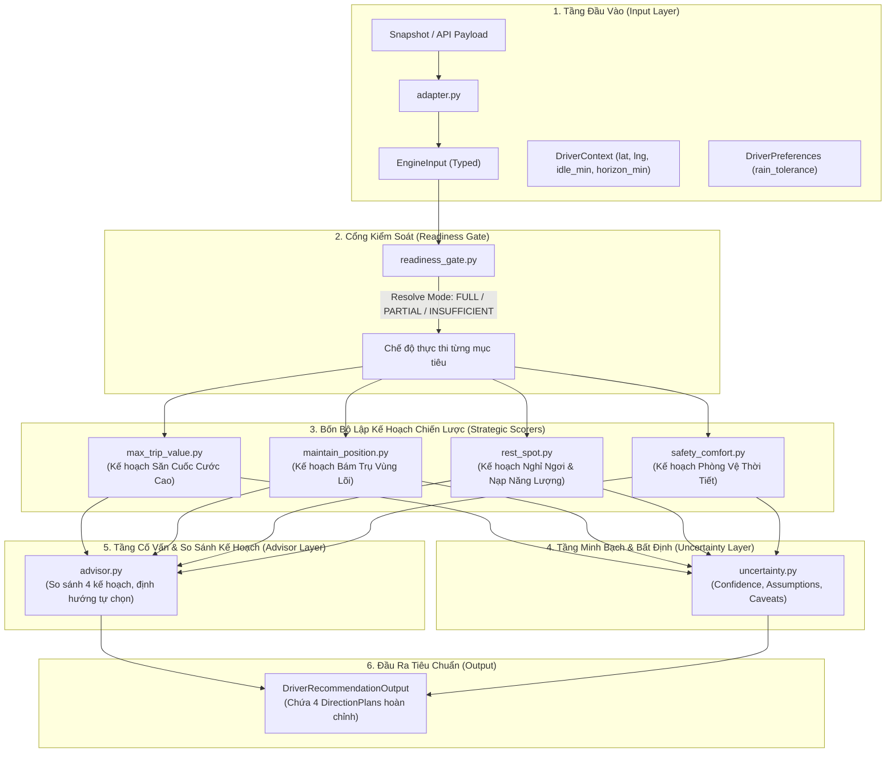

# Hướng Dẫn Kiến Trúc & Hiện Thực Decision Engine (GigCa)

Tài liệu này giải thích chi tiết cấu trúc, nguyên lý thiết kế và toàn bộ các module mã nguồn được hiện thực trong thư mục [`engine/src/`](src/), chịu trách nhiệm đóng vai trò **Bộ não ra quyết định chiến lược (Decision Engine)** cho tài xế xe công nghệ GigCa.

---

## 1. Triết Lý Thiết Kế: Mô Hình "Kế Hoạch Du Lịch" (Travel Itinerary Model)

### 1.1. Ví dụ so sánh trực quan
Để dễ hiểu nhất về cách vận hành của hệ thống, hãy hình dung bài toán **Lập Kế Hoạch Du Lịch**:
* Engine không liệt kê rời rạc một danh sách các địa điểm rồi tự ý chọn ra một địa điểm duy nhất ép người dùng phải đi.
* Thay vào đó, hệ thống cung cấp **các phương án kế hoạch hoàn chỉnh** theo các hướng mục tiêu khác nhau:
  * **Hướng 1: Tiết kiệm nhất** $\rightarrow$ Hệ thống đưa ra trình tự các điểm đến, thời gian di chuyển, phương tiện chi phí thấp để bảo toàn ràng buộc tiết kiệm ngân sách.
  * **Hướng 2: Nhiều trải nghiệm nhất** $\rightarrow$ Hệ thống đưa ra kế hoạch tối ưu thời gian, đi được tối đa địa điểm, liệt kê thứ tự mấy giờ đi đâu, hoạt động gì.
  * **Người du lịch là người quyết định cuối cùng** sẽ chọn đi theo kế hoạch nào tùy vào ngân sách và thể lực của mình.

### 1.2. Ứng dụng vào GigCa Decision Engine
Hoàn toàn tương tự, GigCa Decision Engine **không chọn thay tài xế một quyết định duy nhất**, và **không chỉ liệt kê các lựa chọn rời rạc** trong mỗi mục tiêu.

Thay vào đó, Engine xây dựng **4 Kế Hoạch Hành Động Chiến Lược Hoàn Chỉnh (4 Directional Action Plans)** tương ứng với 4 hướng mục tiêu độc lập:

1. **Hướng 1: Kế Hoạch Đón Cuốc Đi Xa & Cước Cao (`max_trip_value`)**  
   Tài xế không có menu cuốc sẵn để so sánh giá tiền; do đó kế hoạch này tập trung **tìm kiếm và định vị tại khu vực/chốt đón có xác suất cao nổ các chuyến đi xa (sân bay, liên quận, ngoại thành) với cước phí lớn**: chọn chốt đứng tiềm năng (sảnh khách sạn, tòa văn phòng hạng A), thiết lập ưu tiên cuốc dài, khống chế thời gian chờ tối đa 20 phút để tránh chờ rỗng, và ghép khách chiều về.
2. **Hướng 2: Kế Hoạch Bám Trụ Vùng Lõi & Vòng Quay Nhanh (`maintain_position`)**  
   Kế hoạch giữ chân tại trung tâm: điểm neo đậu vùng lõi, bộ lọc cuốc ngắn $< 3$km có điểm trả tiếp tục nằm trong trung tâm, tốc độ xoay vòng 10–15 phút/cuốc, thời gian chờ cuốc kế tiếp cực ngắn ($\sim 3$–$5$ phút), $0$km chạy rỗng.
3. **Hướng 3: Kế Hoạch Nghỉ Ngơi & Phục Hồi Thể Lực (`rest_spot`)**  
   Kế hoạch dừng chân nạp năng lượng: chọn điểm nghỉ tối ưu đã xác minh bãi đỗ xe hợp pháp $100\%$, tắt app tạm thời, nghỉ ngơi 25–30 phút (uống nước, sạc pin, chợp mắt), mốc giờ bật lại app đón đầu làn sóng cao điểm tiếp theo.
4. **Hướng 4: Kế Hoạch Lưu Thông An Toàn — Né Mưa & Né Kẹt Xe (`safety_comfort`)**  
   Kế hoạch chạy xe đỡ mệt, giữ sức bền: **hạn chế đi qua các vùng mưa lớn và các đoạn đường kẹt xe**; điều hướng xe vào các hành lang giao thông thông thoáng (tốc độ $> 25$ km/h, đường cao không ngập nước), né các nút giao ùn tắc và vùng mưa dông lớn, giữ đều ga để bảo vệ xe khỏi thủy kích và giữ cho cơ thể không bị kiệt sức.

---

## 2. Bảy Nguyên Tắc Thiết Kế Bất Biến

1. **Bốn kế hoạch chiến lược độc lập, không gộp điểm tổng:** Tuyệt đối không tính điểm trung bình hay tạo một `overallScore` duy nhất.
2. **Kỷ luật dữ liệu nghiêm ngặt (Thiếu dữ liệu $\neq$ 0):** Dữ liệu chưa có nguồn kiểm chứng phải trả về trạng thái tường minh `insufficient_data` hoặc `partial`, không bao giờ được âm thầm gán bằng 0 hay giá trị trung tính.
3. **Không suy diễn chéo (No Cross-Inference):** Không dùng mật độ POI để đoán số lượng cuốc xe; không dùng tỷ lệ đường đông quanh khu vực để khẳng định mật độ giao thông của một đoạn đường cụ thể.
4. **Giải thích truy nguyên về số (Traceable Explanations):** Mọi lý do gợi ý hiển thị cho tài xế phải theo khuôn mẫu: `[Hành động/Nhận định] + [Con số cụ thể] + [Nguồn dữ liệu]`.
5. **Hàm thuần, tất định (Pure Deterministic Function):** Cùng một đầu vào (input dữ liệu + bối cảnh tài xế) $\rightarrow$ luôn trả về cùng 4 kế hoạch hành động tất định. Lõi tính toán không phụ thuộc API mạng bên ngoài.
6. **Tham số hóa toàn bộ ngưỡng:** Các ngưỡng chịu mưa, danh mục điểm nghỉ được quản lý tập trung ở file cấu hình, không hardcode trong logic nghiệp vụ.
7. **Tài xế là người quyết định cuối cùng:** Engine đóng vai trò người đồng hành tham mưu, cung cấp 4 kế hoạch hành động để tài xế lựa chọn.

---

## 3. Kiến Trúc Phân Tầng Hệ Thống



---

## 4. Chi Tiết Từng Module Mã Nguồn Trong `engine/src/`

### 4.1. Cấu trúc Kế Hoạch Hành Động & Kiểu Dữ Liệu: [`types.py`](src/types.py)
Định nghĩa toàn bộ các thực thể dữ liệu bằng Python `dataclass(frozen=True)` bất biến:

* **Mô hình Kế Hoạch Hành Động Cụ Thể:**
  * `PlanStep`: Từng bước hành động theo trình tự thời gian:
    * `step_number`: Số thứ tự bước (1, 2, 3, 4...)
    * `time_window`: Mốc thời gian thực hiện (ví dụ: `"0 - 5 phút"`, `"16:00 - 16:30"`, `"Sau 30 phút"`)
    * `action`: Tên hành động cụ thể cần làm
    * `instruction`: Chỉ dẫn thao tác chi tiết
    * `expected_outcome`: Kết quả kỳ vọng sau bước này
  * `DirectionPlan`: Một bản kế hoạch chiến lược hoàn chỉnh cho 1 hướng mục tiêu:
    * `plan_id`: Định danh hướng (`max_trip_value`, `maintain_position`, `rest_spot`, `safety_comfort`)
    * `direction_title`: Tiêu đề phương án
    * `objective_focus`: Trọng tâm chiến lược
    * `summary`: Tóm tắt kế hoạch hành động
    * `target_location`: Địa điểm / trục đường mục tiêu chính
    * `steps`: Danh sách các bước hành động cụ thể (`list[PlanStep]`)
    * `key_metrics`: Các chỉ số đo lường dự phóng (doanh thu net, tỷ lệ giữ vị trí, thời gian nghỉ, cửa sổ an toàn...)
    * `trade_offs`: Sự đánh đổi và cảnh báo rủi ro cần biết
    * `contingency_fallback`: Phương án dự phòng nếu gặp trở ngại
* **Kết Quả Từng Lăng Kính:**
  * `ObjectiveResult`: Chứa `plan: DirectionPlan | None`, `status` (`available`, `partial`, `insufficient_data`), `confidence` (`none`, `low`, `medium`), danh sách dữ liệu tham chiếu nền tảng `candidates`, cùng các cờ thời tiết, giao thông và lưu ý dữ liệu.
* **Đầu Ra Cao Nhất:**
  * `DriverRecommendationOutput`: Trả về từ điển 4 mục tiêu chứa 4 kế hoạch hành động độc lập, danh sách giả định và thông điệp khẳng định quyền tự quyết của tài xế.

---

### 4.2. Quản Lý Cấu Hình & Tham Số: [`config.py`](src/config.py)
* Nạp cấu hình từ [`config/engine_config.json`](../../config/engine_config.json) hoặc giá trị chuẩn fallback.
* `RAIN_TOLERANCE_THRESHOLDS`: Ngưỡng mưa theo mức chịu đựng (`low`: 30%/0.5mm, `medium`: 55%/2.0mm, `high`: 75%/5.0mm).
* `REST_CATEGORIES`: Danh mục điểm nghỉ được công nhận (`cafe`, `gas_station`, `parking`, `rest_area`, `toilet`).
* `OBJECTIVE_DATA_DEPENDENCIES`: Bản đồ phụ thuộc dữ liệu bắt buộc của từng mục tiêu.

---

### 4.3. Cổng Kiểm Soát Sẵn Sàng Dữ Liệu: [`readiness_gate.py`](src/readiness_gate.py)
* **Hàm cốt lõi:** `resolve_readiness(objective, data_status, objective_readiness) -> ReadinessMode`
* **Quy tắc:** Scorer không bao giờ tự ý quyết định mode chạy. Cổng kiểm soát soi xét từng nhóm dữ liệu phụ thuộc; nếu bất kỳ nguồn nào bị thiếu hoặc chưa kiểm chứng, cổng hạ cấp xuống `PARTIAL` hoặc `INSUFFICIENT` để bảo vệ tính trung thực của dữ liệu.

---

### 4.4. Hiện Thực 4 Bộ Lập Kế Hoạch Chiến Lược: [`scorers/`](src/scorers/)

#### Hướng 1: Kế Hoạch Săn Cuốc Giá Trị Cao ([`max_trip_value.py`](src/scorers/max_trip_value.py))
* **Biểu cước:** cước khách trả = 12.500đ cho 2 km đầu + 4.300đ/km tiếp theo + 350đ/phút di chuyển sau 2 km đầu (`config/engine_config.json` → `tariff`, có `source`); tài xế nhận `driver_share` = 75% (giả định cố định, thực tế 50–75%). Tài xế nhập biểu cước riêng thì ghi đè từng trường và kết quả ghi nhãn nguồn.
* **Khi `INSUFFICIENT`:** Báo trạng thái trung thực `insufficient_data` vì chưa có nhật ký chuyến THẬT; luôn kèm bảng kịch bản what-if theo biểu cước (cước khách trả, tiền nhận, đ/giờ, cước tối thiểu để đạt mục tiêu, cự ly tối thiểu).
* **Khi `AVAILABLE` / `PARTIAL`:**
  * Chọn vùng (học từ nhật ký của tài xế) có thu nhập ròng/giờ cao nhất, đã trừ xăng cả chặng chở khách và chạy rỗng.
  * Xây dựng `DirectionPlan`:
    * *Bước 1 (0–5 phút):* Di chuyển đến điểm chốt đón khách tiềm năng cao.
    * *Bước 2 (5–15 phút):* Bật app và thiết lập ưu tiên cuốc đường dài/sân bay.
    * *Bước 3 (15–20 phút):* Thiết lập giới hạn chờ tối đa 20 phút để tránh thời gian chờ rỗng.
    * *Bước 4 (Sau cuốc):* Bật tính năng đón khách chiều ngược về trung tâm để tối ưu hóa km di chuyển.
  * Chỉ số dự phóng: `expected_net_value_vnd` (tiền nhận theo biểu cước), `customer_fare_vnd`, `net_after_fuel_vnd`, `estimated_duration_min`, `yield_vnd_per_hour` (+ khoảng P10–P90), `min_accept_fare_vnd` (tiền nhận tối thiểu) và `min_accept_customer_fare_vnd` (cước khách trả tương ứng), `driver_share`.
  * Đánh đổi: Cuốc dài đưa xe ra xa trung tâm, cần chủ động tìm khách chiều về.

#### Hướng 2: Kế Hoạch Bám Trụ Vùng Lõi & Vòng Quay Nhanh ([`maintain_position.py`](src/scorers/maintain_position.py))
* **Khi `INSUFFICIENT`:** Trả về dữ liệu bối cảnh `context_only` chỉ để đọc, không tính xác suất cuốc kế.
* **Khi `AVAILABLE` / `PARTIAL`:**
  * Chọn khu vực neo đậu trung tâm có điểm giữ vị trí tối ưu (`position_score`).
  * Xây dựng `DirectionPlan`:
    * *Bước 1 (Ngay lập tức):* Neo đậu tại chốt chờ trung tâm.
    * *Bước 2 (0–15 phút):* Nhận cuốc bán kính ngắn $< 3$km nội quận.
    * *Bước 3 (15–20 phút):* Xoay vòng cuốc kế tiếp ngay tại điểm vừa trả khách (chờ $\sim 3$–$5$ phút).
    * *Bước 4 (Sau chuỗi cuốc):* Tự động quay về trục lõi trong 5 phút nếu có cuốc chệch hướng.
  * Chỉ số dự phóng: `position_score`, `p_wait_le_pct` (P(chờ ≤ 10/20 phút), survival), `expected_wait_min`, `median_wait_min`.
  * Đánh đổi: Cước từng chuyến thấp hơn, phải di chuyển trong mật độ xe đông.

#### Hướng 3: Kế Hoạch Nghỉ Ngơi & Phục Hồi Thể Lực ([`rest_spot.py`](src/scorers/rest_spot.py))
* **Nguyên tắc:** Bắt buộc có mẫu định tuyến thực tế (`routing_sample`), không dùng khoảng cách đường chim bay.
* Xây dựng `DirectionPlan`:
  * *Bước 1 (1–2 phút tới):* Tạm dừng app để tránh bị trôi tỷ lệ nhận cuốc.
  * *Bước 2 (2–5 phút tới):* Di chuyển lộ trình ngắn đến điểm đỗ xe máy hợp pháp đã xác minh thực địa.
  * *Bước 3 (5–30 phút tới):* Nghỉ ngơi 25 phút trong phòng máy lạnh/bóng mát, uống nước, sạc điện thoại, chợp mắt.
  * *Bước 4 (Sau 30 phút):* Bật lại app trước 5 phút để đón sóng cao điểm tiếp theo với thể lực tốt nhất.
* Chỉ số dự phóng: `distance_m`, `duration_min`, `verified_parking`, `recommended_rest_min = 25`, `amenities`.
* Đánh đổi: Tạm ngưng doanh thu trong 25–30 phút nghỉ ngơi.

#### Hướng 4: Kế Hoạch Phòng Vệ Thời Tiết & Cửa Sổ An Toàn ([`safety_comfort.py`](src/scorers/safety_comfort.py))
* Đánh giá timeline thời tiết và tính toán cửa sổ an toàn (`safe_window_min`), giờ đỉnh mưa (`peak_rain_time`).
* Xây dựng `DirectionPlan`:
  * *Nếu mưa ập đến ngay (`TRU_MUA_NGAY`):* Tấp ngay vào mái che/cây xăng gần nhất; tạm ngưng chạy trong mưa lớn để bảo vệ xe và điện thoại; tiếp tục chạy khi đường ráo nước.
  * *Nếu có cửa sổ an toàn (`DI_CHUYEN_TRUOC_KHI_MUA`):* Tranh thủ hoàn thành cuốc ngắn kết thúc trước giờ mưa đỉnh; chuẩn bị áo mưa bọc chống nước; chủ động tấp trú khi mưa lớn; đón sóng giá tăng (surge) sau mưa.
  * *Nếu khô ráo (`THOI_TIET_THUAN_LOI`):* Khai thác tối đa điều kiện thời tiết lý tưởng; duy trì tốc độ an toàn.
* Chỉ số dự phóng: `safe_window_min`, `peak_rain_time`, `traffic_speed_kmh`.
* Đánh đổi: Bỏ qua cuốc surge trong tâm mưa bão để bảo vệ xe khỏi thủy kích và tai nạn.

---

### 4.5. Tầng Cố Vấn & So Sánh 4 Kế Hoạch: [`advisor.py`](src/advisor.py)
* **Không chọn thay tài xế:** Cố vấn phân tích bối cảnh thực tế và đặt 4 kế hoạch hành động lên bàn cân để hỗ trợ tài xế đưa ra quyết định tối ưu:
  * *Tình thế bối cảnh:* Trạng thái mưa bão, thời gian rảnh, số lượng điểm nghỉ sẵn có.
  * *Hướng dẫn tự chọn:* Nếu muốn cước cao $\rightarrow$ Chọn Kế hoạch 1; Nếu muốn quay vòng nhanh bám trung tâm $\rightarrow$ Chọn Kế hoạch 2; Nếu mệt mỏi $\rightarrow$ Chọn Kế hoạch 3; Nếu thời tiết chuyển biến xấu $\rightarrow$ Ưu tiên Kế hoạch 4.
  * *Kế hoạch dự phòng:* Phương án ứng biến nếu điểm nghỉ kín chỗ hoặc mưa sớm hơn dự báo.
* Hỗ trợ chế độ **Hệ chuyên gia tất định (Offline Expert System)** chạy tức thì và chế độ **Google Gemini 2.5 Flash** khi có API key.

---

### 4.6. Các Module Phụ Trợ Trong `engine/src/`
* [`adapter.py`](src/adapter.py): Điều hợp nạp snapshot JSON và chuyển đổi kiểu dữ liệu an toàn.
* [`explanation.py`](src/explanation.py): Định dạng chuỗi văn bản truy nguyên về số đo cụ thể.
* [`uncertainty.py`](src/uncertainty.py): Đóng gói độ tin cậy, danh sách giả định và tuyên bố miễn trừ trách nhiệm.
* [`whatif.py`](src/whatif.py): Bảng kịch bản theo biểu cước công bố (Bậc 0, không cần nhật ký): cước khách trả, tiền tài xế nhận, đ/giờ, cước tối thiểu và cự ly tối thiểu để đạt mục tiêu.
* Đầu vào kiểm thử (đặt tay) nằm ở [`../engine/tests/fixtures/`](tests/fixtures/) — chỉ unit test dùng; code chạy thật không import.
* [`engine.py`](src/engine.py): Hàm điều phối trung tâm `run_driver_engine(...)`, nhận input và trả về 4 kế hoạch hoàn chỉnh.
* [`verify.py`](src/verify.py): Kiểm tra trên dữ liệu THẬT: số học biểu cước, snapshot ETL, và mọi nhật ký thật trong `data/raw/driver_logs/`.

---

## 5. Bảng Tra Cứu Toàn Bộ Mã Nguồn Trong `engine/src/`

| Tên Tệp | Vai Trò Trong Kiến Trúc |
|---|---|
| [`config.py`](src/config.py) | Quản lý tham số cấu hình, ngưỡng thời tiết, danh mục nghỉ |
| [`types.py`](src/types.py) | Hợp đồng giao tiếp dữ liệu (`PlanStep`, `DirectionPlan`, `ObjectiveResult`...) |
| [`readiness_gate.py`](src/readiness_gate.py) | Cổng kiểm soát khả năng sẵn sàng của dữ liệu cho từng mục tiêu |
| [`scorers/max_trip_value.py`](src/scorers/max_trip_value.py) | Lập kế hoạch hành động săn cuốc cước cao |
| [`scorers/maintain_position.py`](src/scorers/maintain_position.py) | Lập kế hoạch hành động bám trụ vùng lõi & quay vòng nhanh |
| [`scorers/rest_spot.py`](src/scorers/rest_spot.py) | Lập kế hoạch hành động nghỉ ngơi nạp năng lượng an toàn |
| [`scorers/safety_comfort.py`](src/scorers/safety_comfort.py) | Lập kế hoạch hành động phòng vệ thời tiết & cửa sổ an toàn |
| [`advisor.py`](src/advisor.py) | Cố vấn so sánh 4 kế hoạch, định hướng quyền tự quyết |
| [`explanation.py`](src/explanation.py) | Chuẩn hóa định dạng giải thích truy nguyên về số |
| [`uncertainty.py`](src/uncertainty.py) | Quản lý độ tin cậy, giả định và tuyên bố giới hạn dữ liệu |
| [`adapter.py`](src/adapter.py) | Bộ điều hợp chuyển đổi JSON Snapshot sang `EngineInput` |
| [`whatif.py`](src/whatif.py) | Bảng kịch bản theo biểu cước (công bố hoặc tài xế nhập), không xếp hạng vùng |
| [`personal_model.py`](src/personal_model.py) | Học cự ly/tốc độ/thời gian chờ theo vùng từ nhật ký THẬT của tài xế; biểu cước + tỷ lệ nhận; đối chiếu tỷ lệ nhận quan sát |
| [`engine.py`](src/engine.py) | Điểm vào chính (`run_driver_engine`), kết nối toàn bộ hệ thống |
| [`verify.py`](src/verify.py) | Kiểm tra trên dữ liệu thật (biểu cước, snapshot ETL, nhật ký thật nếu có) |

---

## 6. Hướng Dẫn Tích Hợp Cho Backend Role (FastAPI)

Các kỹ sư Backend chỉ cần nạp snapshot và gọi Decision Engine thông qua 4 dòng lệnh đơn giản:

```python
from engine.src.adapter import load_engine_input_from_dict
from engine.src.engine import run_driver_engine
from engine.src.types import DriverContext, DriverPreferences

# 1. Nạp snapshot dữ liệu đã chuẩn hóa
engine_input = load_engine_input_from_dict(snapshot_json_payload)

# 2. Tạo ngữ cảnh từ request của tài xế
driver_ctx = DriverContext(
    current_lat=request.origin.lat,
    current_lng=request.origin.lon,
    idle_duration_min=request.idle_min,
    horizon_min=request.horizon_min,
)
driver_prefs = DriverPreferences(
    rain_tolerance_level=request.preferences.rain_tolerance_level
)

# 3. Chạy Decision Engine (hàm thuần, không side-effect)
recommendation = run_driver_engine(engine_input, driver_ctx, driver_prefs)

# 4. Trả về kết quả 4 Kế hoạch hành động cho Frontend hiển thị
return {
    "generated_at": recommendation.generated_at,
    "objectives": recommendation.objectives,  # Mỗi objective chứa 1 DirectionPlan hoàn chỉnh
    "assumptions": recommendation.assumptions_used,
    "final_note": recommendation.final_note,
}
```

---

## 7. Cách Chạy Thử Nghiệm

Chạy thử nghiệm giao diện dòng lệnh tương tác:

```powershell
# Snapshot ETL thật (Open-Meteo / OSM / OSRM) + biểu cước công bố: hai hướng kiếm tiền ở Bậc 0 (bảng kịch bản)
python scripts/run_demo.py

# Thêm xăng, mục tiêu đ/giờ (và biểu cước riêng nếu có) của tài xế
python scripts/run_demo.py --profile data/raw/driver_logs/d01_profile.json

# Thêm nhật ký THẬT của tài xế (tạo bằng python -m data.driver_log_import, xem data/driver_input/README.md)
python scripts/run_demo.py --driver-log data/raw/driver_logs/d01_engine_log.json --lat 10.7725 --lng 106.698

# Kiểm tra trên dữ liệu thật; unit test dùng đầu vào đặt tay trong engine/tests/fixtures
python scripts/verify_engine.py
python -m unittest discover -s engine/tests -t .
```

**Không còn dữ liệu mô phỏng trong đường chạy thật.** Bộ `data/fixtures/hcmc_full_simulated_snapshot.json`, `engine/src/ml/simulate.py`, `scripts/make_demo_driver_log.py` và `engine/src/mock_data.py` đã bị gỡ; một test (`test_tariff_and_driver_data.TestNoSimulatedDataInProductPath`) chặn việc đưa chúng trở lại.

> **v2:** engine đã được nâng cấp (neo thời gian thật, nhận biết vị trí tài xế, loại thay vì bịa khi thiếu dữ liệu, kiểm tra độ vững, thứ tự xem xét 4 hướng). Xem [UPGRADE_V2.md](UPGRADE_V2.md).

---

## Lớp ML (v5): [`src/ml/`](src/ml/)

Mọi mô hình chỉ học từ dữ liệu THẬT của chính tài xế (đợt chờ, chuyến) và đều bị **cổng backtest** kiểm soát: chỉ thay baseline thống kê khi thắng nó trên phần lịch sử *mới hơn* (chia theo thời gian), cùng thước đo. **Không có dữ liệu huấn luyện mô phỏng** và không công bố độ chính xác nào trước khi có nhật ký thật: dưới `ml.min_spells` / `ml.min_cycles` engine không fit gì và nói rõ; unit test chỉ kiểm cơ chế (cổng từ chối khi không có bằng chứng, xác suất hợp lệ, tất định).

| Thành phần | File | Làm gì | Cổng / giới hạn |
|---|---|---|---|
| Thời gian chờ có ngữ cảnh | `wait_model.py` | Survival rời rạc (hazard) trên đợt chờ theo giờ, thứ, mưa, vị trí; offline/đổi chỗ là bị kiểm duyệt. Ghi đè `P(chờ ≤ t)` và chờ kỳ vọng theo vùng cho thời điểm hiện tại | Phải thắng Kaplan–Meier theo ô VÀ thắng mô hình không ngữ cảnh (đối chứng) trên tập kiểm tra; ≥ 60 đợt chờ |
| Khoảng conformal | `cycle_model.py` | Hồi quy phân vị + CQR cho năng suất một chu kỳ (chờ + chuyến), khoảng 80% | Không hiển thị nếu độ phủ trên tập kiểm tra thấp hơn danh nghĩa quá 10 điểm %; ≥ 60 chu kỳ |
| Bandit Thompson | `bandit.py` | `p_best` và cờ "nên thử" cho vùng ít dữ liệu nhưng còn cơ hội | Chỉ giải thích, không tự đổi khuyến nghị; chưa có đánh giá trên dữ liệu thật |
| Nhập liệu tiếng Việt | `intake.py` | Câu như "2 km đầu 12.500đ, mỗi km tiếp theo 4.300đ, 350đ/phút, nhận 75%, muốn 100k/giờ, mưa là nghỉ" → hồ sơ/tùy chọn; kiểm khoảng hợp lý; có thể cắm LLM nhưng mọi số phải xuất hiện trong câu | Luôn cần tài xế xác nhận |
| Kiểm tra số trong giải thích | `explain_check.py` | LLM chỉ diễn đạt lại; số nào không truy được về output engine thì loại văn bản, dùng lời của engine | Cần nhưng chưa đủ: chứng minh không bịa số, không chứng minh dùng số đúng chỗ |
| Nhập chuyến từ văn bản OCR | `earnings_import.py` | Văn bản (OCR/vision) của lịch sử chuyến → ứng viên `trip_log`; thiếu trường hoặc điểm đón không có trong bảng tọa độ thì trả về `needs_input`, không điền mặc định | Số tiền có thể là cước gộp nên luôn gắn `amount_to_confirm`; tài xế phải xác nhận trước khi dùng. OCR nằm ngoài engine |
| Cộng đồng (Bậc 3, nguyên mẫu) | `ml/community.py` | Gộp ẩn danh theo ô với k-ẩn danh (ô < k tài xế bị loại), mỗi tài xế tính một lần; co Bayes thực nghiệm cho tài xế mới | CHƯA nối vào engine; k-ẩn danh không phải differential privacy |

Kết quả nằm ở `DriverRecommendationOutput.ml_insights` (backtest, phần ML có được dùng không, khoảng conformal theo vùng, bandit). Cấu hình ở mục `ml` của `config/engine_config.json`. Fit được cache theo nội dung nhật ký vì `explain=True` gọi engine nhiều lần. Ảnh chụp màn hình thu nhập **chưa** dựng được nhật ký: thiếu tọa độ điểm đón, cần GPS từ app companion.

